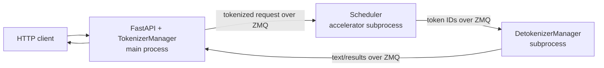

# Architecture Overview

SGLang is a serving system, not one monolithic model loop. Its default language
model path combines an HTTP/API layer, request preparation, one or more
schedulers that own accelerator execution, detokenization, native kernels, and
optional routing or distributed services. The repository also contains a
separate diffusion runtime and two Rust routing/gateway projects.

This overview establishes boundaries and the default request path. It does not
claim full coverage of the large runtime managers; their ledger rows are
deliberately marked `partial`.

## What is in this snapshot

The top-level [project README](https://github.com/EltonChang1/sglang/blob/f464e77d17a3908ad0ea32547b1e8b039bcbd354/README.md#about)
describes the product as a high-performance serving framework for language and
multimodal models. The implementation is divided into these major surfaces:

| Area | Responsibility | Do not confuse it with |
| --- | --- | --- |
| [`python/sglang/lang`](https://github.com/EltonChang1/sglang/tree/f464e77d17a3908ad0ea32547b1e8b039bcbd354/python/sglang/lang) | Frontend language primitives and remote backend clients | The SRT scheduler and GPU execution loop |
| [`python/sglang/srt`](https://github.com/EltonChang1/sglang/tree/f464e77d17a3908ad0ea32547b1e8b039bcbd354/python/sglang/srt) | Language-model serving runtime: protocols, tokenization, scheduling, caches, model execution, distributed modes, and operations | The diffusion runtime |
| [`python/sglang/kernels`](https://github.com/EltonChang1/sglang/tree/f464e77d17a3908ad0ea32547b1e8b039bcbd354/python/sglang/kernels) | JIT/AOT native operations and their Python interfaces | All model execution; the runtime also calls external and PyTorch backends |
| [`python/sglang/multimodal_gen`](https://github.com/EltonChang1/sglang/tree/f464e77d17a3908ad0ea32547b1e8b039bcbd354/python/sglang/multimodal_gen) | Image, video, diffusion, VLA, and related generation pipelines | [`srt/multimodal`](https://github.com/EltonChang1/sglang/tree/f464e77d17a3908ad0ea32547b1e8b039bcbd354/python/sglang/srt/multimodal), which prepares media inputs for SRT-served models |
| [`rust`](https://github.com/EltonChang1/sglang/blob/f464e77d17a3908ad0ea32547b1e8b039bcbd354/rust/Cargo.toml#L1-L7) | Workspace for native gRPC, multimodal, and server crates that can be built into the Python distribution | The standalone gateway workspace |
| [`sgl-model-gateway`](https://github.com/EltonChang1/sglang/blob/f464e77d17a3908ad0ea32547b1e8b039bcbd354/sgl-model-gateway/Cargo.toml#L1-L35) | Rust gateway/router library and binaries, with HTTP/gRPC, policies, discovery, observability, mesh, and bindings | A scheduler that executes model forward passes |
| [`experimental/sgl-router`](https://github.com/EltonChang1/sglang/blob/f464e77d17a3908ad0ea32547b1e8b039bcbd354/experimental/sgl-router/Cargo.toml#L1-L20) | Slim KV-aware OpenAI-compatible router and KV indexer | The larger model gateway or SRT's internal scheduler |
| [`test`](https://github.com/EltonChang1/sglang/tree/f464e77d17a3908ad0ea32547b1e8b039bcbd354/test), [`benchmark`](https://github.com/EltonChang1/sglang/tree/f464e77d17a3908ad0ea32547b1e8b039bcbd354/benchmark), and [`examples`](https://github.com/EltonChang1/sglang/tree/f464e77d17a3908ad0ea32547b1e8b039bcbd354/examples) | Validation, performance/accuracy measurement, and runnable usage | Production modules, even when they import internal APIs directly |

Two boundaries matter immediately. First, the frontend language can target a
remote backend and therefore is not synonymous with the local SRT. Second,
multimodal *input* support in SRT and multimodal *generation* in
`multimodal_gen` have different managers, models, and entry points.

## Public entry surfaces

The installed package exposes three broad ways in:

1. `import sglang` exposes frontend primitives and backend clients, plus lazy
   `Engine` and `ServerArgs` handles. Import is not inert: it redirects selected
   third-party caches before heavy imports and applies Hugging Face patches
   before exporting the API
   ([`sglang/__init__.py`, lines 1-68](https://github.com/EltonChang1/sglang/blob/f464e77d17a3908ad0ea32547b1e8b039bcbd354/python/sglang/__init__.py#L1-L68)).
2. The `sglang` console script calls `sglang.cli.main:main`, while
   `killall_sglang` has a separate process-cleanup entry point
   ([`pyproject.toml`, lines 202-204](https://github.com/EltonChang1/sglang/blob/f464e77d17a3908ad0ea32547b1e8b039bcbd354/python/pyproject.toml#L202-L204)).
3. Python callers can construct `sglang.Engine`. The offline API launches the
   same tokenizer/scheduler/detokenizer machinery but does not run the FastAPI
   surface. The class itself documents the shared three-component engine
   ([`Engine`, lines 209-221](https://github.com/EltonChang1/sglang/blob/f464e77d17a3908ad0ea32547b1e8b039bcbd354/python/sglang/srt/entrypoints/engine.py#L209-L221)).

The `sglang serve` command is a dispatcher, not just an alias for one server.
It normalizes a positional model path, discovers installed serve backends,
loads SGLang plugins, auto-detects a unique non-LLM match, and otherwise falls
back to the built-in LLM path
([`serve`, lines 166-207](https://github.com/EltonChang1/sglang/blob/f464e77d17a3908ad0ea32547b1e8b039bcbd354/python/sglang/cli/serve.py#L166-L207),
[`auto_detect`, lines 173-212](https://github.com/EltonChang1/sglang/blob/f464e77d17a3908ad0ea32547b1e8b039bcbd354/python/sglang/cli/serve_backends.py#L173-L212)).
See the [entry-point reference](reference/entrypoints.md) for the complete
contract and failure behavior.

## Startup and process topology

The default LLM branch parses raw CLI values into `ServerArgs`, then
`run_server` resolves them once and selects encoder-only, legacy gRPC, Ray, or
default HTTP mode
([`_run_llm`, lines 90-99](https://github.com/EltonChang1/sglang/blob/f464e77d17a3908ad0ea32547b1e8b039bcbd354/python/sglang/cli/serve.py#L90-L99),
[`run_server`, lines 16-57](https://github.com/EltonChang1/sglang/blob/f464e77d17a3908ad0ea32547b1e8b039bcbd354/python/sglang/launch_server.py#L16-L57)).
Resolution is guarded because the transformations are not generally idempotent;
a failed resolution record must be rebuilt instead of retried in place
([`resolve_once`, lines 3667-3698](https://github.com/EltonChang1/sglang/blob/f464e77d17a3908ad0ea32547b1e8b039bcbd354/python/sglang/srt/server_args.py#L3667-L3698)).

For a single-node, single-tokenizer, non-data-parallel default launch, the
topology is:

`PortArgs` names the tokenizer, scheduler-input, detokenizer, RPC, and metrics
channels, using local IPC in the normal case and TCP-derived addresses for
data-parallel attention
([`PortArgs`, lines 10551-10635](https://github.com/EltonChang1/sglang/blob/f464e77d17a3908ad0ea32547b1e8b039bcbd354/python/sglang/srt/server_args.py#L10551-L10635)).
The launch sequence allocates those channels, publishes resolved configuration
for the tokenizer role, starts scheduler processes, starts detokenization, then
waits for scheduler readiness before accepting the initialized engine
([`Engine._launch_subprocesses`, lines 1022-1237](https://github.com/EltonChang1/sglang/blob/f464e77d17a3908ad0ea32547b1e8b039bcbd354/python/sglang/srt/entrypoints/engine.py#L1022-L1237)).

Configuration publication is process-local. `publish` resolves the record,
projects read-only namespace bags, and records the process role; republishing
is explicitly last-publish-wins
([`runtime_context.publish`, lines 1308-1355](https://github.com/EltonChang1/sglang/blob/f464e77d17a3908ad0ea32547b1e8b039bcbd354/python/sglang/srt/runtime_context.py#L1308-L1355)).
This is why a child process should read its published view rather than infer
configuration again from environment variables or raw arguments.

### Topology variations

- Tensor or pipeline parallelism starts scheduler processes across calculated
  rank ranges; data parallelism instead starts a controller that owns scheduler
  creation
  ([`_launch_scheduler_processes`, lines 818-933](https://github.com/EltonChang1/sglang/blob/f464e77d17a3908ad0ea32547b1e8b039bcbd354/python/sglang/srt/entrypoints/engine.py#L818-L933)).
- Multiple tokenizer workers cause Uvicorn or Granian to run multiple HTTP
  workers that rebuild tokenizer-side state from shared memory
  ([`init_multi_tokenizer`, lines 216-266](https://github.com/EltonChang1/sglang/blob/f464e77d17a3908ad0ea32547b1e8b039bcbd354/python/sglang/srt/entrypoints/http_server.py#L216-L266),
  [`_setup_and_run_http_server`, lines 2514-2726](https://github.com/EltonChang1/sglang/blob/f464e77d17a3908ad0ea32547b1e8b039bcbd354/python/sglang/srt/entrypoints/http_server.py#L2514-L2726)).
- Multiple detokenizer workers are placed behind a dedicated router while the
  public detokenizer channel remains stable
  ([`_launch_detokenizer_subprocesses`, lines 935-990](https://github.com/EltonChang1/sglang/blob/f464e77d17a3908ad0ea32547b1e8b039bcbd354/python/sglang/srt/entrypoints/engine.py#L935-L990)).
- The embedded Rust server path replaces Python HTTP, tokenization, and
  detokenization, but still launches scheduler processes and explicitly warms
  the runtime before advertising readiness
  ([`launch_server`, lines 2767-2828](https://github.com/EltonChang1/sglang/blob/f464e77d17a3908ad0ea32547b1e8b039bcbd354/python/sglang/srt/entrypoints/http_server.py#L2767-L2828)).
- Native Rust gRPC can also run alongside the Python HTTP server by receiving a
  `RuntimeHandle` that delegates into the initialized tokenizer/runtime state
  ([`_start_native_grpc_server_for_runtime`, lines 2729-2755](https://github.com/EltonChang1/sglang/blob/f464e77d17a3908ad0ea32547b1e8b039bcbd354/python/sglang/srt/entrypoints/http_server.py#L2729-L2755)).

## One generation request

The native `/generate` endpoint exposes the shortest visible path through the
default runtime:

1. FastAPI converts the body to `GenerateReqInput`. Streaming requests wrap the
   tokenizer manager's async iterator as server-sent events; non-streaming
   requests take its first and only final item
   ([`generate_request`, lines 889-940](https://github.com/EltonChang1/sglang/blob/f464e77d17a3908ad0ea32547b1e8b039bcbd354/python/sglang/srt/entrypoints/http_server.py#L889-L940)).
2. `TokenizerManager.generate_request` normalizes batch-shaped arguments,
   creates per-request state, respects pause and model-update locks, tokenizes a
   single request, dispatches it, and awaits output. If an exception occurs
   before normal output removes request state, it explicitly discards the
   pending entries
   ([`generate_request`, lines 767-833](https://github.com/EltonChang1/sglang/blob/f464e77d17a3908ad0ea32547b1e8b039bcbd354/python/sglang/srt/managers/tokenizer_manager.py#L767-L833)).
3. The scheduler subprocess constructs `Scheduler`, returns initialization
   information to its parent, and blocks in a selected event loop
   ([`run_scheduler_process`, lines 5145-5212](https://github.com/EltonChang1/sglang/blob/f464e77d17a3908ad0ea32547b1e8b039bcbd354/python/sglang/srt/managers/scheduler.py#L5145-L5212)).
   Normal, overlapped, pipeline-parallel, and disaggregated modes select
   different loops rather than one loop full of every condition
   ([`dispatch_event_loop`, lines 5050-5077](https://github.com/EltonChang1/sglang/blob/f464e77d17a3908ad0ea32547b1e8b039bcbd354/python/sglang/srt/managers/scheduler.py#L5050-L5077)).
4. For text generation, output tokens pass through the detokenizer process,
   which either runs its ordinary loop or a multi-HTTP-worker loop
   ([`run_detokenizer_process`, lines 516-539](https://github.com/EltonChang1/sglang/blob/f464e77d17a3908ad0ea32547b1e8b039bcbd354/python/sglang/srt/managers/detokenizer_manager.py#L516-L539)).
5. The tokenizer manager correlates returned output with request state, yields
   streaming chunks or the final object, records completion metrics, and aborts
   work when a client disconnect makes the result unwanted. The detailed batch
   output transformation is intentionally left for the request-lifecycle guide.

The important architectural fact is ownership: HTTP protocol objects and
client connections live on the tokenizer side; accelerator batching and model
execution live in scheduler processes; detokenization is isolated so decoding
text cannot stall accelerator scheduling.

## Core invariants and failure boundaries

- **A `ServerArgs` record is resolved once.** Re-entering non-idempotent
  resolution can apply transformations twice; failed resolution poisons that
  record for retry
  ([`resolve_once`, lines 3667-3698](https://github.com/EltonChang1/sglang/blob/f464e77d17a3908ad0ea32547b1e8b039bcbd354/python/sglang/srt/server_args.py#L3667-L3698)).
- **Parallelism must satisfy launch-time compatibility checks.** Examples
  include rank divisibility, pipeline restrictions, data-parallel multi-node
  restrictions, and incompatible compile/padding modes
  ([`check_server_args`, lines 9802-9839](https://github.com/EltonChang1/sglang/blob/f464e77d17a3908ad0ea32547b1e8b039bcbd354/python/sglang/srt/server_args.py#L9802-L9839)).
- **The parent does not declare readiness until schedulers report it.** Each
  scheduler sends initialization information through a one-way pipe before
  entering its loop; the parent builds its tokenizer-side limits from that
  result
  ([`run_scheduler_process`, lines 5193-5212](https://github.com/EltonChang1/sglang/blob/f464e77d17a3908ad0ea32547b1e8b039bcbd354/python/sglang/srt/managers/scheduler.py#L5193-L5212),
  [`_launch_subprocesses`, lines 1203-1224](https://github.com/EltonChang1/sglang/blob/f464e77d17a3908ad0ea32547b1e8b039bcbd354/python/sglang/srt/entrypoints/engine.py#L1203-L1224)).
- **Optional extension failure is isolated during auto-detection, but explicit
  selection is strict.** Auto-detection warns and skips a broken unrelated
  backend; `--model-type=name` surfaces discovery, type, duplicate-provider,
  and API-version errors
  ([`ServeBackendRegistry.get`, lines 119-171](https://github.com/EltonChang1/sglang/blob/f464e77d17a3908ad0ea32547b1e8b039bcbd354/python/sglang/cli/serve_backends.py#L119-L171),
  [`auto_detect`, lines 173-212](https://github.com/EltonChang1/sglang/blob/f464e77d17a3908ad0ea32547b1e8b039bcbd354/python/sglang/cli/serve_backends.py#L173-L212)).
- **Child-process cleanup is a boundary, not an afterthought.** The CLI kills
  descendants in a `finally` block, the engine registers shutdown at exit, and
  a subprocess watchdog turns unexpected child exits into visible runtime
  failure
  ([`serve`, lines 191-207](https://github.com/EltonChang1/sglang/blob/f464e77d17a3908ad0ea32547b1e8b039bcbd354/python/sglang/cli/serve.py#L191-L207),
  [`Engine.__init__`, lines 265-296](https://github.com/EltonChang1/sglang/blob/f464e77d17a3908ad0ea32547b1e8b039bcbd354/python/sglang/srt/entrypoints/engine.py#L265-L296)).

## Study checks

- Explain why the LLM backend has no detector yet remains the automatic
  fallback.
- Draw the default IPC channels from `PortArgs` without looking at the Mermaid
  diagram.
- Identify what moves into the data-parallel controller and what remains in the
  tokenizer process when `dp_size > 1`.
- Explain why configuration resolution and process-local publication are two
  separate concepts.
- Trace where a pre-scheduler tokenization failure and a post-dispatch client
  disconnect are cleaned up.
- Name the two different ways Rust participates in the serving path: replacing
  the Python server or adding native gRPC beside it.
