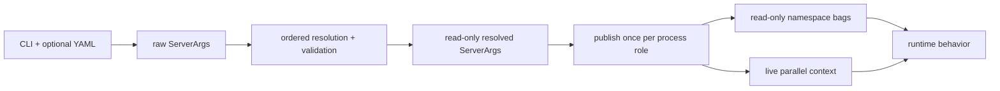

# Configuration and Startup

SGLang does not treat command-line arguments as a bag of values that every
module may mutate. Startup moves configuration through three deliberately
different forms:



The distinction matters. Raw values record what the operator supplied;
resolution derives a self-consistent launch; publication gives each process a
traceable, structured view; live parallel properties report what distributed
groups actually created. Reading the wrong tier can make a correct option look
ignored or make a startup-only value look safe to change at runtime.

This chapter follows the default language-model launch. Model-family-specific
override details, individual scheduler policies, and protocol adapters receive
their own later guides. The [file reference](reference/configuration-startup.md)
records the exact coverage boundary.

## 1. The CLI schema is the dataclass

Most `sglang serve` options are fields on `ServerArgs`. An `Annotated` field
can carry three independent kinds of information:

- its Python type and dataclass default;
- `Arg` metadata for the CLI name, aliases, parser, choices, action, and help;
- an `NS` path declaring where the resolved value will live after publication.

`add_cli_args_from_dataclass` converts field names such as `tp_size` to
`--tp-size`, unwraps optional and literal types, uses `nargs="+"` for ordinary
lists, and turns boolean fields into `store_true` actions. It pins `dest` to the
dataclass field even when the public flag has another name
([`Arg`, `NS`, and CLI generation](https://github.com/EltonChang1/sglang/blob/f464e77d17a3908ad0ea32547b1e8b039bcbd354/python/sglang/srt/arg_groups/arg_utils.py#L62-L345)).
Manual `add_argument` calls are reserved for `--config`, registry-derived
choices, and deprecated translations that cannot be expressed as ordinary
field metadata
([`ServerArgs.add_cli_args`](https://github.com/EltonChang1/sglang/blob/f464e77d17a3908ad0ea32547b1e8b039bcbd354/python/sglang/srt/server_args.py#L9297-L9556)).

The visual sections in the dataclass are a useful operator map, but they are
not the same thing as runtime namespaces:

| Operator-facing section | Examples of decisions it feeds |
| --- | --- |
| Model, tokenizer, quantization, dtype | model source, tokenizer, loader, weight representation |
| Memory and scheduling | token capacity, chunking, admission defaults, cache allocation |
| TP/PP/DP/CP and expert parallelism | process count, rank hierarchy, collectives, MoE placement |
| Device, kernels, graphs, compilation | hardware, attention/sampling backend, capture strategy |
| HTTP, TLS, API, streaming | bind address, authentication, protocol behavior, response cadence |
| Logging, metrics, tracing | process logging, Prometheus, request metrics, OTLP |
| Speculation, Mamba, HiCache, multimodal, LoRA | feature-specific execution and storage choices |
| Disaggregation, offload, weight loading | cross-worker transfer, startup ownership, reload behavior |
| Debug and operational controls | dumps, crash behavior, health/warmup, worker counts |

The source contains more than forty such headings
([field groups](https://github.com/EltonChang1/sglang/blob/f464e77d17a3908ad0ea32547b1e8b039bcbd354/python/sglang/srt/server_args.py#L518-L3655)).
Do not memorize every flag first. Learn which phase owns it, then consult the
CLI help and file reference when tracing a concrete mode.

### YAML precedence

`prepare_server_args` builds the parser first. If `--config` appears, it loads
one YAML mapping and converts its keys and values into ordinary argument tokens
before parsing
([`prepare_server_args`](https://github.com/EltonChang1/sglang/blob/f464e77d17a3908ad0ea32547b1e8b039bcbd354/python/sglang/srt/server_args.py#L10510-L10544)).
The merger returns `config_args + cli_args_without_config`, so normal argparse
last-value behavior implements:

```text
explicit CLI value > YAML value > dataclass/parser default
```

Booleans need special handling: YAML `true` emits a `store_true` flag, while
YAML `false` omits it. Lists become one flag followed by all elements; mappings
become JSON strings for fields whose parser expects structured input
([`ConfigArgumentMerger`](https://github.com/EltonChang1/sglang/blob/f464e77d17a3908ad0ea32547b1e8b039bcbd354/python/sglang/srt/server_args_config_parser.py#L17-L187)).

Important failure boundaries are intentional:

- only one `--config` is allowed, the path must follow the flag, and only
  `.yaml` or `.yml` files with a mapping root are accepted;
- custom argparse actions other than ordinary store/store-true are rejected in
  YAML, so a deprecated translation or `LoRAPathAction` must be expressed on
  the CLI instead;
- an empty YAML list emits no tokens, so it does not mean “force an empty value”
  for an option whose parser/default is nonempty;
- unknown keys are left for argparse to reject, keeping one grammar rather than
  maintaining a second YAML schema.

After parsing, basic logging is configured before `ServerArgs` construction so
later resolution warnings have the requested format and level.

## 2. Construction is raw; resolution is ordered

`ServerArgs.__post_init__` intentionally does nothing. This lets tests,
launchers, and subprocess serialization inspect or transport the exact input
without triggering model discovery, hardware probes, or backend selection
([construction and `resolve_once`](https://github.com/EltonChang1/sglang/blob/f464e77d17a3908ad0ea32547b1e8b039bcbd354/python/sglang/srt/server_args.py#L3657-L3698)).

`resolve_once` is the gate. It runs the pipeline once, records failure, and
refuses a retry on the same damaged object. This is stronger than a convenient
cache: some handlers transform their own inputs, so a second pass can halve a
chunk size or scale a conservativeness factor twice. A corrected retry must
construct a fresh record.

The dispatcher snapshots all raw dataclass fields, initializes a declaration
stash, then runs phases in dependency order
([`_run_resolution_pipeline`](https://github.com/EltonChang1/sglang/blob/f464e77d17a3908ad0ea32547b1e8b039bcbd354/python/sglang/srt/server_args.py#L3759-L3977)):

1. Apply model-independent hooks and validate protocol, security, hardware,
   and early cache constraints. `model_path` values `none` and `dummy` stop
   here so lightweight fixtures avoid model and accelerator work.
2. Resolve model sources, multimodal and TLS input, deprecated options, missing
   defaults, disaggregation, legacy CP names, and CUDA-graph input.
3. Apply in-tree device defaults and then an out-of-tree platform's
   `apply_server_args_defaults`; record direct plugin writes so publication can
   reproduce them.
4. Probe device memory, apply model-architecture declarations, and resolve
   sampling, attention, page, grammar, cache, and graph compatibility.
5. Resolve DP/CP/MoE/PP topology, speculation, loading, tokenizer batching,
   environment propagation, advanced caches, debug behavior, and final
   capability checks.
6. Materialize all declarations onto the record. From this point direct writes
   to real fields raise; post-publication changes belong to runtime namespace
   bags.

This pipeline is both normalization and policy. A user choice can remain as
entered, be filled because it was `auto`/`None`, be translated from a legacy
name, or be rejected because another resolved choice makes it unsafe.

### Why declarations exist

Resolution writers append `(source, fields)` declarations. A read-only
`ResolvedView` overlays later declarations on raw input while the pipeline is
still running, and last writer wins when materialization occurs. The model
override registry and ordered post-process passes return dictionaries instead
of mutating the record
([declaration machinery](https://github.com/EltonChang1/sglang/blob/f464e77d17a3908ad0ea32547b1e8b039bcbd354/python/sglang/srt/arg_groups/overrides.py#L126-L383)).
This provides provenance and prevents an override that only changed a Python
attribute from disappearing when namespace bags are projected.

Some decisions cannot occur in the main pipeline. LoRA validation and automatic
parser detection need launch-stage objects such as normalized adapter paths or
chat-template information. `declare_late_resolution` permits those writes only
before the same record is published
([late resolution](https://github.com/EltonChang1/sglang/blob/f464e77d17a3908ad0ea32547b1e8b039bcbd354/python/sglang/srt/arg_groups/overrides.py#L263-L301)).
`replace_resolved` is the safe way to clone an already resolved record for a
process boundary; ordinary `dataclasses.replace` would lose resolution state
and rerun non-idempotent handlers
([`replace_resolved`](https://github.com/EltonChang1/sglang/blob/f464e77d17a3908ad0ea32547b1e8b039bcbd354/python/sglang/srt/server_args.py#L3700-L3747)).

## 3. Platform discovery is lazy but affects resolution

`current_platform` is resolved on first attribute access. An explicit
`SGLANG_PLATFORM` scans entry-point metadata but imports and activates only the
named plugin. Missing plugins, activation returning `None`, and invalid
platform classes are hard errors. Without an explicit selection, all platform
plugins are asked to activate; exactly one wins, multiple matches are rejected,
and no match falls back in the order CPU opt-in, CUDA, ROCm, XPU, then the
conservative base platform
([platform discovery](https://github.com/EltonChang1/sglang/blob/f464e77d17a3908ad0ea32547b1e8b039bcbd354/python/sglang/srt/platforms/__init__.py#L49-L172)).

The CPU check intentionally precedes accelerator checks, allowing a developer
on a GPU host to force the CPU engine. Explicit filtering also avoids importing
unrelated vendor dependencies merely to decide that they are inactive.

`SRTPlatform` combines device identity/operations with SRT hooks for defaults,
graph runners, KV pools, allocators, compilation, quantization, and capability
flags
([interface](https://github.com/EltonChang1/sglang/blob/f464e77d17a3908ad0ea32547b1e8b039bcbd354/python/sglang/srt/platforms/interface.py#L26-L140)).
The distinction between **active** and **planned** device methods is important:
an out-of-tree override of a planned method does not take effect until core
call sites migrate to it
([`DeviceMixin`](https://github.com/EltonChang1/sglang/blob/f464e77d17a3908ad0ea32547b1e8b039bcbd354/python/sglang/srt/platforms/device_mixin.py#L94-L267)).
Many detailed backend choices still use model/hardware predicates in the
resolution pipeline; the platform object is not yet the sole hardware policy
layer.

## 4. Publication separates static configuration from live state

Every process calls `publish(server_args, role=...)` before reading runtime
configuration. Publication rechecks the one-time resolution gate, installs the
resolved startup record, projects namespace bags from `NS(...)` metadata, and
records the process role
([`publish`](https://github.com/EltonChang1/sglang/blob/f464e77d17a3908ad0ea32547b1e8b039bcbd354/python/sglang/srt/runtime_context.py#L1308-L1355)).

The runtime context then exposes five kinds of state:

| Tier | Representative accessor | Semantics |
| --- | --- | --- |
| Startup record | `get_server_args()` | Resolved, read-only reproduction/debug record |
| Config bags | `get_model()`, `get_exec()`, `get_schedule()` | Process-static resolved leaves; normal business-code source of truth |
| Parallel context | `get_parallel()` | Live rank/size/group getters plus published topology-only config leaves |
| Runtime flags/resources | `get_flags()`, `get_resources()` | Mutable lifecycle state and owned handles, not copies of config |
| Per-forward flags | `get_forward()` | Scoped eager/context-local or graph-visible execution state |

`_build_config_bags` walks every field's dotted namespace and creates nested,
read-only attribute bags. Leaves are real attributes so Torch Dynamo can trace
them without a Python fallback; collisions between a leaf and subgroup fail at
publication
([bag projection](https://github.com/EltonChang1/sglang/blob/f464e77d17a3908ad0ea32547b1e8b039bcbd354/python/sglang/srt/runtime_context.py#L596-L730)).

After publication, `RuntimeContext.override(source, **fields)` routes flat
field names back to the correct bag, validates every target before writing any,
and records provenance. It deliberately does not mutate `ServerArgs`; otherwise
the startup record and runtime source of truth could disagree
([runtime override and readback](https://github.com/EltonChang1/sglang/blob/f464e77d17a3908ad0ea32547b1e8b039bcbd354/python/sglang/srt/runtime_context.py#L869-L971)).
A second `publish` is last-publish-wins and reprojects the bags, so it discards
post-publication overrides and warns about their provenance. `ensure_published`
avoids that reset when the exact record and role are already installed
([`ensure_published`](https://github.com/EltonChang1/sglang/blob/f464e77d17a3908ad0ea32547b1e8b039bcbd354/python/sglang/srt/runtime_context.py#L1358-L1380)).

The parallel wrapper does not cache distributed facts. Properties delegate to
the canonical process-group and DP-attention getters, while config-only leaves
fall through to the published `parallel` bag. Launcher code that runs before
groups exist explicitly asks for `configured_*_size`; ordinary model code
should prefer the live properties
([`ParallelContext`](https://github.com/EltonChang1/sglang/blob/f464e77d17a3908ad0ea32547b1e8b039bcbd354/python/sglang/srt/runtime_context.py#L116-L310),
[`configured_*` accessors](https://github.com/EltonChang1/sglang/blob/f464e77d17a3908ad0ea32547b1e8b039bcbd354/python/sglang/srt/runtime_context.py#L1733-L1762)).

Optional role auditing adds another boundary. `SGLANG_ROLE_NAMESPACES=record`
records top-level bag reads; `enforce` rejects a role reading outside its
declared set. Recording is disabled inside compiled regions, so an audit must
exercise the same code without compilation before a role is narrowed
([role namespace policy](https://github.com/EltonChang1/sglang/blob/f464e77d17a3908ad0ea32547b1e8b039bcbd354/python/sglang/srt/runtime_context.py#L1170-L1305)).

## 5. Launch converts configuration into processes, ranks, and channels

`Engine._launch_subprocesses` is shared by the offline engine and HTTP server.
Its critical order is
([source](https://github.com/EltonChang1/sglang/blob/f464e77d17a3908ad0ea32547b1e8b039bcbd354/python/sglang/srt/entrypoints/engine.py#L1022-L1237)):

1. configure logging, resolve once, set process environment, and load plugins;
2. run launch-stage validation and auto-parser resolution before publication;
3. snapshot any prior runtime context, publish the tokenizer role, allocate
   channels, and optionally start weight-cache/bootstrap services;
4. launch scheduler ranks directly or launch a data-parallel controller;
5. on rank zero, launch detokenization and construct tokenizer/template state;
6. wait for scheduler initialization data, copy scheduler-derived request
   limits to the tokenizer side, then start the subprocess watchdog.

If publication or port/bootstrap setup fails before any child is spawned, the
previous runtime context is restored exactly
([snapshot and restore](https://github.com/EltonChang1/sglang/blob/f464e77d17a3908ad0ea32547b1e8b039bcbd354/python/sglang/srt/runtime_context.py#L1440-L1484)).
Once children exist, process cleanup rather than config rollback owns failure.

### Rank construction

Without a DP controller, the launcher calculates this node's PP and TP ranges,
maps each `(pp_rank, tp_rank)` to a local device ID, derives attention-CP,
MoE-DP, and MoE-EP ranks, and starts one scheduler process per local pair
([scheduler launch](https://github.com/EltonChang1/sglang/blob/f464e77d17a3908ad0ea32547b1e8b039bcbd354/python/sglang/srt/entrypoints/engine.py#L818-L933)).
The rank hierarchy is explicit:

```text
attention: TP space -> attention DP -> attention CP -> attention TP
MoE:       TP space -> MoE DP       -> expert parallel -> MoE TP
```

`_calculate_rank_ranges` handles both “multiple PP stages per node” and
“one PP stage spans multiple nodes”; `_compute_parallelism_ranks` uses
configured sizes because it is laying out groups that do not exist yet
([rank math](https://github.com/EltonChang1/sglang/blob/f464e77d17a3908ad0ea32547b1e8b039bcbd354/python/sglang/srt/entrypoints/engine.py#L1805-L1864)).
When DP attention or elastic scale-up requires a controller, the parent starts
one controller process and receives the descendant scheduler PIDs in its
readiness result instead.

### Port and endpoint construction

`PortArgs` is runtime wiring, not user configuration. Normal single-node mode
creates unique local `ipc://` paths for tokenizer, scheduler input,
detokenizer, RPC, and metrics. Multi-tokenizer and decoupled-speculation modes
add optional channels and validate their required endpoints
([`PortArgs`](https://github.com/EltonChang1/sglang/blob/f464e77d17a3908ad0ea32547b1e8b039bcbd354/python/sglang/srt/server_args.py#L10552-L10634)).

DP-attention mode derives a stable TCP block from the HTTP or distributed-init
address so multiple processes and nodes agree without sharing temporary file
names. It assigns fixed offsets to detokenizer, RPC, metrics, controller/worker
input, load collection, and Rust DP slots, checks bind availability where this
process owns the port, and handles 65535 overflow by choosing a lower base
([DP-attention endpoints](https://github.com/EltonChang1/sglang/blob/f464e77d17a3908ad0ea32547b1e8b039bcbd354/python/sglang/srt/server_args.py#L10635-L10722)).

## 6. “Ready” has two levels

### Scheduler/model readiness

Each scheduler publishes its scheduler role before construction. After model
loading, cache allocation, graph capture, and scheduler initialization, it
sends a dictionary containing `status`, token limits, and startup timing over a
one-way pipe, then enters its event loop
([`get_init_info`](https://github.com/EltonChang1/sglang/blob/f464e77d17a3908ad0ea32547b1e8b039bcbd354/python/sglang/srt/managers/scheduler.py#L1675-L1690),
[`run_scheduler_process`](https://github.com/EltonChang1/sglang/blob/f464e77d17a3908ad0ea32547b1e8b039bcbd354/python/sglang/srt/managers/scheduler.py#L5145-L5233)).

The parent polls pipes in five-second intervals instead of blocking forever.
It rejects a non-ready status and checks all scheduler processes after every
timeout, turning an OOM/SIGKILL or early exit into a startup error with the
child's exit code
([`_wait_for_scheduler_ready`](https://github.com/EltonChang1/sglang/blob/f464e77d17a3908ad0ea32547b1e8b039bcbd354/python/sglang/srt/entrypoints/engine.py#L1773-L1802)).
Only after this handshake does the tokenizer side consume
`max_req_input_len`. This gate proves the model processes initialized; it does
not yet prove that the public HTTP request path completed a forward pass.

### Public service readiness and warmup

The Python HTTP server starts with `server_status=Starting`; `/health` returns
503 in that state and during graceful shutdown
([health endpoint](https://github.com/EltonChang1/sglang/blob/f464e77d17a3908ad0ea32547b1e8b039bcbd354/python/sglang/srt/entrypoints/http_server.py#L655-L682)).
The ASGI lifespan starts a warmup thread after protocol adapters and optional
sidecars have initialized
([lifespan](https://github.com/EltonChang1/sglang/blob/f464e77d17a3908ad0ea32547b1e8b039bcbd354/python/sglang/srt/entrypoints/http_server.py#L269-L430)).

The general warmup first polls `/model_info`, then chooses a real request:

- `/generate` for ordinary generation or tokenizer-skipped input IDs;
- `/v1/chat/completions` with a small image for an eligible VLM;
- `/encode` for an embedding model;
- one request per DP rank for prefill/decode disaggregation.

An ordinary warmup success sets the Python tokenizer manager to `Up`; a request
exception or non-200 assertion logs the traceback and kills the process tree.
Disaggregation aggregates status codes instead: any non-200 result sets
`UnHealthy`, but the helper still returns the success of its initial
`/model_info` poll, so `_wait_and_warmup` continues to GC freeze and the final
readiness log. Skipping warmup explicitly sets `Up`. Elastic EP joiners skip it
because traffic reaches them only after adoption
([`_execute_server_warmup` and `_wait_and_warmup`](https://github.com/EltonChang1/sglang/blob/f464e77d17a3908ad0ea32547b1e8b039bcbd354/python/sglang/srt/entrypoints/http_server.py#L2187-L2412)).
After warmup, the server asks all runtime components to freeze long-lived GC
objects; this optimization is best-effort, so its HTTP failure warns but does
not revoke readiness.

Another soft boundary is checkpoint-engine startup: waiting for initial weights
has a fixed timeout, but timeout only logs an error and proceeds to warmup
([`_wait_weights_ready`](https://github.com/EltonChang1/sglang/blob/f464e77d17a3908ad0ea32547b1e8b039bcbd354/python/sglang/srt/entrypoints/http_server.py#L2415-L2434)).
For these modes, do not treat the final friendly log line alone as the health
contract; inspect the warmup/status path exercised by the deployment.

The embedded Rust server is different. Its static health/model-info endpoints
can return 200 before a forward pass, so the parent performs a synchronous real
warmup before logging readiness and then blocks on scheduler exit
([Rust launch branch](https://github.com/EltonChang1/sglang/blob/f464e77d17a3908ad0ea32547b1e8b039bcbd354/python/sglang/srt/entrypoints/http_server.py#L2767-L2828)).

## 7. Shutdown has graceful and forceful boundaries

The scheduler handles `ShutdownReq` by setting `gracefully_exit`; its event loop
then leaves, and the process releases host/cache resources only on that graceful
path. On an exception it signals the parent and deliberately avoids potentially
hanging device synchronization during cleanup
([shutdown handler](https://github.com/EltonChang1/sglang/blob/f464e77d17a3908ad0ea32547b1e8b039bcbd354/python/sglang/srt/managers/scheduler.py#L5011-L5014),
[process `finally`](https://github.com/EltonChang1/sglang/blob/f464e77d17a3908ad0ea32547b1e8b039bcbd354/python/sglang/srt/managers/scheduler.py#L5220-L5233)).

`Engine.shutdown` stops the liveness watchdog, closes the RPC socket without
linger, terminates engine-owned weight-cache daemons gracefully so they can
unlink readiness/socket files, then kills and waits for remaining descendants.
Tokenizer-owned multimedia and CUDA-VMM transports are closed in `finally`
([`Engine.shutdown`](https://github.com/EltonChang1/sglang/blob/f464e77d17a3908ad0ea32547b1e8b039bcbd354/python/sglang/srt/entrypoints/engine.py#L1239-L1269)).
The HTTP lifespan separately shuts down native gRPC, tool servers, sidecars,
and its warmup thread. The outer CLI still owns last-resort descendant cleanup,
so a server exception does not leave accelerator processes behind.

The practical rule is: a normal control request may release subsystem-owned
resources precisely; startup or fatal exceptions cross into process-tree
cleanup because partially initialized device/NCCL state is not reliably
recoverable in place.

## Invariants and failure checklist

- Build a new `ServerArgs` after resolution failure; never retry the same one.
- Finish all launch-stage late resolution before publishing that record.
- Read resolved runtime leaves from namespace bags, not from environment or the
  startup record; ask for configured parallel sizes only before groups exist.
- Treat `ServerArgs` as read-only after resolution. Runtime changes go through
  `RuntimeContext.override` and must appear in its provenance log/readback.
- Ensure `tp_size * pp_size` can be laid out across nodes and every derived
  attention/MoE size divides its parent space. `check_server_args` owns the
  wider cross-feature matrix
  ([validation entry](https://github.com/EltonChang1/sglang/blob/f464e77d17a3908ad0ea32547b1e8b039bcbd354/python/sglang/srt/server_args.py#L9802-L10003)).
- Do not equate a bound HTTP port or scheduler pipe message with public
  readiness; the warmup status is the final Python-server gate.
- Diagnose startup hangs from the current gate: config/model resolution, port
  allocation, scheduler pipe readiness, HTTP bind/model-info polling, or the
  warmup forward request.

## Study checks

1. Given a YAML `tp-size: 4` and CLI `--tp-size 8`, explain why the raw record
   contains 8 and when that value may still be rejected or transformed.
2. Explain why a model override must declare its change instead of assigning a
   field, and why `dataclasses.replace` is unsafe on a resolved record.
3. For TP=8, attention DP=2, attention CP=2, calculate attention TP size and
   derive the attention-CP rank for TP ranks 0 through 7.
4. Identify which facts come from `get_parallel().tp_size` and which require
   `configured_tp_size()` during launch.
5. Trace a cold start through both readiness gates and state what `/health`
   returns while warmup is running.
6. Compare a scheduler exception, a failed HTTP warmup, and a graceful
   `ShutdownReq`: which owner detects it, and which cleanup boundary runs?
