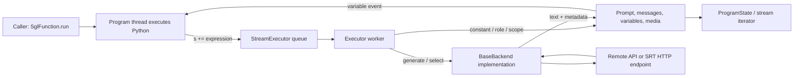

# Frontend Language Execution

The `sglang.lang` frontend is a small host-language interpreter. A decorated
Python function still controls ordinary branching, loops, tool calls, and data
access, but `s += ...` appends typed SGL expressions to a program state. A
`StreamExecutor` evaluates those expressions in order and delegates model work
to a backend. This is different from submitting one static prompt and also
different from the SRT scheduler: the frontend orchestrates a program on the
client side, while the selected backend owns inference
([`function`](https://github.com/EltonChang1/sglang/blob/f464e77d17a3908ad0ea32547b1e8b039bcbd354/python/sglang/lang/api.py#L23-L32),
[`ProgramState.__iadd__`](https://github.com/EltonChang1/sglang/blob/f464e77d17a3908ad0ea32547b1e8b039bcbd354/python/sglang/lang/interpreter.py#L1023-L1027),
[`StreamExecutor._execute`](https://github.com/EltonChang1/sglang/blob/f464e77d17a3908ad0ea32547b1e8b039bcbd354/python/sglang/lang/interpreter.py#L461-L503)).

Read the [architecture overview](01-architecture-overview.md) first. The
companion [file and symbol reference](reference/frontend-language.md) records
the exact coverage boundary. Provider-specific clients and the complete chat
template catalog intentionally remain later frontend passes.

## 1. The useful mental model: Python produces an ordered expression stream

Consider the characteristic shape:

```python
@sgl.function
def answer(s, question):
    s += "Question: " + question + "\n"
    s += "Answer: " + sgl.gen("answer", stop="\n")
    if "search" in s["answer"].lower():
        s += run_tool(s["answer"])
```

`@function` replaces `answer` with an `SglFunction`. Calling `.run()` creates a
`StreamExecutor` and `ProgramState`, then calls the original Python function
with that state as `s`
([`SglFunction`](https://github.com/EltonChang1/sglang/blob/f464e77d17a3908ad0ea32547b1e8b039bcbd354/python/sglang/lang/ir.py#L141-L183),
[`run_program`](https://github.com/EltonChang1/sglang/blob/f464e77d17a3908ad0ea32547b1e8b039bcbd354/python/sglang/lang/interpreter.py#L57-L90)).
Strings become `SglConstantText`; generation, selection, roles, media, scopes,
and reasoning separation are their own expression classes. Reading
`s["answer"]` waits for the corresponding variable event, so normal Python can
branch on a model result before submitting later expressions
([expression dispatch](https://github.com/EltonChang1/sglang/blob/f464e77d17a3908ad0ea32547b1e8b039bcbd354/python/sglang/lang/interpreter.py#L461-L503),
[`get_var`](https://github.com/EltonChang1/sglang/blob/f464e77d17a3908ad0ea32547b1e8b039bcbd354/python/sglang/lang/interpreter.py#L354-L357)).

The ordinary threaded path has two client-side execution lanes:



This split explains three otherwise surprising behaviors. The decorated
function is not compiled before execution; ordinary Python executes live.
Model-dependent reads synchronize only at the variable being read. Finally,
backend errors occur in the worker and are recorded on the state, unless the
program thread itself observes a failed variable and raises
([worker loop](https://github.com/EltonChang1/sglang/blob/f464e77d17a3908ad0ea32547b1e8b039bcbd354/python/sglang/lang/interpreter.py#L422-L459),
[`ProgramState.error`](https://github.com/EltonChang1/sglang/blob/f464e77d17a3908ad0ea32547b1e8b039bcbd354/python/sglang/lang/interpreter.py#L912-L916)).

## 2. Program construction and argument binding

`SglFunction.__init__` introspects the wrapped function and requires its first
positional argument to be named exactly `s`. It records the remaining
positional names and defaults; keyword-only parameters are not included in the
recorded batch signature
([argument inspection](https://github.com/EltonChang1/sglang/blob/f464e77d17a3908ad0ea32547b1e8b039bcbd354/python/sglang/lang/ir.py#L141-L153)).

`.bind(**kwargs)` returns a new wrapper with accumulated bound arguments. At
execution, `run_program` updates the call keyword dictionary with those bound
values, so a binding wins over a same-named keyword supplied to `.run()`; a
same-named positional value instead reaches Python as a duplicate argument
([binding](https://github.com/EltonChang1/sglang/blob/f464e77d17a3908ad0ea32547b1e8b039bcbd354/python/sglang/lang/ir.py#L154-L158),
[merge order](https://github.com/EltonChang1/sglang/blob/f464e77d17a3908ad0ea32547b1e8b039bcbd354/python/sglang/lang/interpreter.py#L67-L79)).
The bound wrapper does not copy `num_api_spec_tokens` in this snapshot. Binding
a function configured for API speculative execution therefore resets that
option; do not assume `.bind()` preserves every wrapper attribute.

Calling an `SglFunction` normally is shorthand for `.run()`. During an active
`TracingScope`, the same call traces instead, which lets nested SGL functions
participate in one symbolic graph
([`SglFunction.__call__`](https://github.com/EltonChang1/sglang/blob/f464e77d17a3908ad0ea32547b1e8b039bcbd354/python/sglang/lang/ir.py#L316-L324)).

The default backend is mutable process-wide state. `.run()`, `.run_batch()`,
`.trace()`, and `.cache()` use an explicit backend first, then
`global_config.default_backend`. `Runtime` wrapper objects are recognized by
their `endpoint` attribute and unwrapped before interpretation
([`GlobalConfig`](https://github.com/EltonChang1/sglang/blob/f464e77d17a3908ad0ea32547b1e8b039bcbd354/python/sglang/lang/global_config.py#L4-L25),
[backend selection](https://github.com/EltonChang1/sglang/blob/f464e77d17a3908ad0ea32547b1e8b039bcbd354/python/sglang/lang/ir.py#L212-L221),
[unwrapping](https://github.com/EltonChang1/sglang/blob/f464e77d17a3908ad0ea32547b1e8b039bcbd354/python/sglang/lang/interpreter.py#L67-L70)).
Concurrent applications should prefer explicit backends because changing the
global affects later calls across the process.

## 3. IR nodes describe operations; `ProgramState` gives them imperative life

`SglExpr` supplies concatenation and tracing metadata. Adding strings and
expressions constructs an `SglExprList`; it does not concatenate strings
immediately. The concrete nodes fall into five groups
([`SglExpr`](https://github.com/EltonChang1/sglang/blob/f464e77d17a3908ad0ea32547b1e8b039bcbd354/python/sglang/lang/ir.py#L327-L394),
[node definitions](https://github.com/EltonChang1/sglang/blob/f464e77d17a3908ad0ea32547b1e8b039bcbd354/python/sglang/lang/ir.py#L397-L643)):

| Group | Nodes | Effect when interpreted |
| --- | --- | --- |
| Prompt content | `SglConstantText`, `SglImage`, `SglVideo` | Append text or a template media token and retain encoded media |
| Model operations | `SglGen`, `SglSelect` | Ask the backend for free-form generation or scored choice selection |
| Conversation structure | `SglRoleBegin`, `SglRoleEnd` | Apply template delimiters and build OpenAI-shaped message history |
| Variables and structure | `SglVariable`, scope begin/end, fork nodes, concatenate/append | Wait on prior results, capture a text slice, or combine child states |
| Optimization/postprocessing | `SglCommitLazy`, `SglSeparateReasoning` | Flush backend-specific lazy work or split reasoning from visible text |

`ProgramState` is the user-facing handle. `+=` submits work; indexing waits for
a named variable; `text()` and `messages()` synchronize and return accumulated
state; role and variable-scope methods provide context managers; `fork()`
creates a `ProgramStateGroup`
([`ProgramState`](https://github.com/EltonChang1/sglang/blob/f464e77d17a3908ad0ea32547b1e8b039bcbd354/python/sglang/lang/interpreter.py#L852-L1042)).

`StreamExecutor` owns all mutable execution state: a unique client-side ID,
arguments and sampling defaults, variable values and readiness events, result
metadata, prompt text, chat messages, media, fork offsets, speculative text,
and streaming events
([initialization](https://github.com/EltonChang1/sglang/blob/f464e77d17a3908ad0ea32547b1e8b039bcbd354/python/sglang/lang/interpreter.py#L274-L340)).
The queue preserves submission order. A variable event is created before its
expression enters the queue, which makes an immediate `s[name]` safe: the
program thread blocks until the worker publishes the value or releases events
after failure
([submission](https://github.com/EltonChang1/sglang/blob/f464e77d17a3908ad0ea32547b1e8b039bcbd354/python/sglang/lang/interpreter.py#L342-L368),
[event initialization](https://github.com/EltonChang1/sglang/blob/f464e77d17a3908ad0ea32547b1e8b039bcbd354/python/sglang/lang/interpreter.py#L788-L797)).

## 4. Sampling defaults merge at the moment of generation

`.run()` and `.run_batch()` build one `SglSamplingParams` record of call-level
defaults. Every `sgl.gen(...)` stores another record whose `None` values mean
"inherit." Immediately before a generation, `_resolve_sampling_params`
deep-copies the defaults, overlays every non-`None` expression field, then
adds the active chat template's stop strings
([run defaults](https://github.com/EltonChang1/sglang/blob/f464e77d17a3908ad0ea32547b1e8b039bcbd354/python/sglang/lang/ir.py#L160-L221),
[`SglGen`](https://github.com/EltonChang1/sglang/blob/f464e77d17a3908ad0ea32547b1e8b039bcbd354/python/sglang/lang/ir.py#L451-L503),
[merge](https://github.com/EltonChang1/sglang/blob/f464e77d17a3908ad0ea32547b1e8b039bcbd354/python/sglang/lang/interpreter.py#L799-L846)).
This is why per-expression settings override `.run(temperature=...)`, while an
omitted expression setting inherits it.

The record also translates the common subset into SRT, OpenAI, Vertex AI,
Anthropic, or LiteLLM keyword shapes. These translations are lossy by design:
providers do not support the same controls
([mapping methods](https://github.com/EltonChang1/sglang/blob/f464e77d17a3908ad0ea32547b1e8b039bcbd354/python/sglang/lang/ir.py#L64-L138)).
`dtype` and `regex` are kept outside most provider mappings. In the pinned
`clone()` implementation they are not preserved, so callers should not use
that helper as a lossless copy of a constrained-generation record
([`clone`](https://github.com/EltonChang1/sglang/blob/f464e77d17a3908ad0ea32547b1e8b039bcbd354/python/sglang/lang/ir.py#L42-L62)).

`gen_int` and `gen_string` are convenience factories that set `dtype`; a
general `gen(dtype=...)` does the same. `RuntimeEndpoint` converts supported
Python types to built-in regexes and, for integers and floats, extends stop
strings with space and newline. If both `dtype` and `regex` are supplied, the
type-derived regex wins with a warning
([factories](https://github.com/EltonChang1/sglang/blob/f464e77d17a3908ad0ea32547b1e8b039bcbd354/python/sglang/lang/api.py#L142-L225),
[type conversion](https://github.com/EltonChang1/sglang/blob/f464e77d17a3908ad0ea32547b1e8b039bcbd354/python/sglang/lang/backend/runtime_endpoint.py#L127-L157)).
The public `gen` validates only that a supplied regex compiles in Python; the
serving grammar engine may impose additional constraints later
([validation](https://github.com/EltonChang1/sglang/blob/f464e77d17a3908ad0ea32547b1e8b039bcbd354/python/sglang/lang/api.py#L102-L139)).

For non-streaming generation, the backend returns `(completion, meta_info)`.
The executor appends a string completion or the first item of a list to the
prompt, but stores the original value in the named variable. For streaming,
it consumes backend deltas, appends each to both prompt and variable, updates
metadata, and signals text and variable events
([generation execution](https://github.com/EltonChang1/sglang/blob/f464e77d17a3908ad0ea32547b1e8b039bcbd354/python/sglang/lang/interpreter.py#L593-L645)).
Named generations are therefore both prompt-producing operations and
synchronization points.

## 5. Roles, media, scopes, and reasoning separation

Role helpers emit explicit begin/end nodes. On begin, the executor may insert
the template's default system prompt, then appends the role prefix. On end, it
captures role content, appends the suffix, and records an OpenAI-shaped message
([role factories](https://github.com/EltonChang1/sglang/blob/f464e77d17a3908ad0ea32547b1e8b039bcbd354/python/sglang/lang/api.py#L246-L286),
[role execution](https://github.com/EltonChang1/sglang/blob/f464e77d17a3908ad0ea32547b1e8b039bcbd354/python/sglang/lang/interpreter.py#L665-L717)).
Roles may not nest. A role context manager must also exit normally to enqueue
its end marker; an exception inside `with s.user():` can leave an open role in
the queued state.

Images and sampled video frames are encoded on the client side, stored with
the executor, and represented in prompt text by the chat template's image
token. A role containing media is recorded using OpenAI vision-style content
parts
([media execution](https://github.com/EltonChang1/sglang/blob/f464e77d17a3908ad0ea32547b1e8b039bcbd354/python/sglang/lang/interpreter.py#L524-L541),
[message construction](https://github.com/EltonChang1/sglang/blob/f464e77d17a3908ad0ea32547b1e8b039bcbd354/python/sglang/lang/interpreter.py#L698-L717)).
`RuntimeEndpoint` accepts only one accumulated media item and sends it as
`image_data`; provider clients have different media conversions
([`_add_images`](https://github.com/EltonChang1/sglang/blob/f464e77d17a3908ad0ea32547b1e8b039bcbd354/python/sglang/lang/backend/runtime_endpoint.py#L337-L340)).

`with s.var_scope(name)` records the current prompt length and, at scope end,
publishes the appended substring as `name`. It captures constants and multiple
model operations together without changing how those operations execute
([scope API](https://github.com/EltonChang1/sglang/blob/f464e77d17a3908ad0ea32547b1e8b039bcbd354/python/sglang/lang/interpreter.py#L882-L886),
[scope execution](https://github.com/EltonChang1/sglang/blob/f464e77d17a3908ad0ea32547b1e8b039bcbd354/python/sglang/lang/interpreter.py#L719-L724)).

`separate_reasoning(expr, model_type=...)` deliberately emits the generation
or selection followed by an `SglSeparateReasoning` marker. In non-streaming
execution the marker loads SRT's `ReasoningParser`, replaces the original
variable with visible text, creates `<name>_reasoning_content`, and rewrites
the current assistant content
([factory](https://github.com/EltonChang1/sglang/blob/f464e77d17a3908ad0ea32547b1e8b039bcbd354/python/sglang/lang/api.py#L289-L292),
[execution](https://github.com/EltonChang1/sglang/blob/f464e77d17a3908ad0ea32547b1e8b039bcbd354/python/sglang/lang/interpreter.py#L754-L786)).
The reliable shape is one named generation or selection inside an assistant
role. Although the marker recursively walks an expression list, it stores only
the last discovered reasoning-event name; a multi-leaf list does not initialize
all reasoning events safely. Streaming silently skips the split, and model-type
validation is deferred until `ReasoningParser` construction.

## 6. Single, batch, and streaming calls have different concurrency

`SglFunction.run` has two observable return modes:

| `stream` | Execution | Return |
| --- | --- | --- |
| `False` | Run the Python program in the caller; executor worker processes queued expressions; enqueue the end sentinel | `ProgramState`; default threaded execution may still have queued work |
| `True` | Start a program thread and return immediately; its executor worker and backend stream continue | live `ProgramState` consumed with `text_iter` or `text_async_iter` |

With the default `use_thread=True`, a non-streaming `.run()` does not pass
`sync=True` to `run_internal`. Indexing a variable waits for that variable;
`text()`, `messages()`, `error()`, or explicit `sync()` joins the executor queue.
A program that reads a generated variable is synchronized through that point,
but trailing work can still be live when `.run()` returns. `use_thread=False`
executes each submitted expression inline, and batch execution explicitly uses
the synchronized path. The program thread and executor worker are separate
when streaming; the worker still executes expressions serially. API
speculative execution cannot combine with streaming
([single-run branch](https://github.com/EltonChang1/sglang/blob/f464e77d17a3908ad0ea32547b1e8b039bcbd354/python/sglang/lang/interpreter.py#L71-L90),
[accessor synchronization](https://github.com/EltonChang1/sglang/blob/f464e77d17a3908ad0ea32547b1e8b039bcbd354/python/sglang/lang/interpreter.py#L350-L368),
[stream guard](https://github.com/EltonChang1/sglang/blob/f464e77d17a3908ad0ea32547b1e8b039bcbd354/python/sglang/lang/interpreter.py#L626-L632)).

`text_iter()` can emit the entire accumulated prompt or only one named
variable. Its asynchronous twin waits for the same thread events through the
event loop's executor. With `return_meta_data=True`, it carries forward three
incremental logprob arrays when metadata arrives without text, then merges them
into the next text-bearing yield
([synchronous iterator](https://github.com/EltonChang1/sglang/blob/f464e77d17a3908ad0ea32547b1e8b039bcbd354/python/sglang/lang/interpreter.py#L918-L954),
[async iterator](https://github.com/EltonChang1/sglang/blob/f464e77d17a3908ad0ea32547b1e8b039bcbd354/python/sglang/lang/interpreter.py#L956-L1012),
[metadata merge](https://github.com/EltonChang1/sglang/blob/f464e77d17a3908ad0ea32547b1e8b039bcbd354/python/sglang/lang/interpreter.py#L250-L271)).

`.run_batch()` accepts dictionaries or positional argument sequences. It
validates positional arity against the recorded function signature, optionally
pre-caches a traced common prefix, and runs one independent program per input
through a thread pool. `num_threads="auto"` chooses at least 96 workers before
clamping to the batch size
([batch normalization](https://github.com/EltonChang1/sglang/blob/f464e77d17a3908ad0ea32547b1e8b039bcbd354/python/sglang/lang/ir.py#L223-L302),
[batch execution](https://github.com/EltonChang1/sglang/blob/f464e77d17a3908ad0ea32547b1e8b039bcbd354/python/sglang/lang/interpreter.py#L93-L181)).
The returned list preserves input order. `generator_style=True` limits
submission to 200-item chunks, but within each chunk it awaits futures in
submission order rather than yielding true completion order
([generator path](https://github.com/EltonChang1/sglang/blob/f464e77d17a3908ad0ea32547b1e8b039bcbd354/python/sglang/lang/interpreter.py#L184-L239)).

## 7. Fork and join operate on client states, with an optional KV shortcut

`s.fork(n)` first commits lazy work for a non-empty multi-fork, synchronizes
the parent, then creates child executors with copied variables, prompt text,
messages, current-role positions, and media. Each child records the prompt
offset where its branch begins
([`StreamExecutor.fork`](https://github.com/EltonChang1/sglang/blob/f464e77d17a3908ad0ea32547b1e8b039bcbd354/python/sglang/lang/interpreter.py#L370-L402)).
The copies do not include existing metadata/events or speculative state. The
`position_ids_offset` argument is accepted by the public API but is not
forwarded into the child executors or a backend hook in this interpreter
snapshot.

`ProgramStateGroup += value` broadcasts one expression, uses a callable to
build one expression per child, or applies a parallel list. The default
`join()` snapshots the parent's variable names, waits for children, and gathers
only variables absent from that snapshot; values become lists in child order.
It does not append branch text to the parent
([group broadcast and join](https://github.com/EltonChang1/sglang/blob/f464e77d17a3908ad0ea32547b1e8b039bcbd354/python/sglang/lang/interpreter.py#L1045-L1098)).

`join(mode="concate_and_append")` instead submits an operation to append every
branch suffix. When both the global optimization flag and backend capability
are true, the executor commits child states and asks the backend to concatenate
their KV-backed requests; otherwise it concatenates their text locally
([dispatch](https://github.com/EltonChang1/sglang/blob/f464e77d17a3908ad0ea32547b1e8b039bcbd354/python/sglang/lang/interpreter.py#L490-L499),
[two implementations](https://github.com/EltonChang1/sglang/blob/f464e77d17a3908ad0ea32547b1e8b039bcbd354/python/sglang/lang/interpreter.py#L729-L752)).
All children are ended after either join. Backends and callers must not treat
them as independently live requests afterward.

## 8. Choice selection scores complete candidates

`sgl.select(...)` and `sgl.gen(choices=...)` create `SglSelect`, not a
constrained one-token generation. The executor delegates candidate scoring to
the backend, stores a `ChoicesDecision` and its metadata, and appends the
chosen string to the prompt
([factories](https://github.com/EltonChang1/sglang/blob/f464e77d17a3908ad0ea32547b1e8b039bcbd354/python/sglang/lang/api.py#L102-L108),
[`_execute_select`](https://github.com/EltonChang1/sglang/blob/f464e77d17a3908ad0ea32547b1e8b039bcbd354/python/sglang/lang/interpreter.py#L647-L658)).

The three built-in decision policies answer different questions:

| Policy | Score used | Bias it addresses |
| --- | --- | --- |
| `token_length_normalized` | highest average conditional prompt logprob | raw sum favoring short tokenizations |
| `greedy_token_selection` | lexicographic token-logprob elimination, padding shorter options with their mean | overlapping candidates whose early tokens tie |
| `unconditional_likelihood_normalized` | average conditional minus unconditional token logprob | candidates favored merely because they are common without context |

The policy interface and metadata are in
[`choices.py`](https://github.com/EltonChang1/sglang/blob/f464e77d17a3908ad0ea32547b1e8b039bcbd354/python/sglang/lang/choices.py#L8-L164).
The runtime endpoint permits only effectively zero selection temperature. It
first submits the common prefix to determine prompt length, scores every
`prefix + choice` with input logprobs starting two tokens back for token
healing, removes a healed prefix token when necessary, and makes a second
unconditional request only for policies that require it
([`RuntimeEndpoint.select`](https://github.com/EltonChang1/sglang/blob/f464e77d17a3908ad0ea32547b1e8b039bcbd354/python/sglang/lang/backend/runtime_endpoint.py#L248-L315)).
Choice lists and returned logprob arrays must be non-empty and aligned. Equal
scores resolve to the first surviving option.

## 9. Tracing records dependencies and extracts only a static prefix

Tracing runs the original Python function with `TracerProgramState` and dummy
`SglArgument` values. Instead of calling a backend, it links expressions with
`prev_node`, creates symbolic variables for generations and selections, and
can print a dependency graph
([`trace_program`](https://github.com/EltonChang1/sglang/blob/f464e77d17a3908ad0ea32547b1e8b039bcbd354/python/sglang/lang/tracer.py#L54-L72),
[`TracerProgramState`](https://github.com/EltonChang1/sglang/blob/f464e77d17a3908ad0ea32547b1e8b039bcbd354/python/sglang/lang/tracer.py#L75-L251),
[`print_graph_dfs`](https://github.com/EltonChang1/sglang/blob/f464e77d17a3908ad0ea32547b1e8b039bcbd354/python/sglang/lang/ir.py#L361-L394)).
Dummy arguments deliberately reject f-string formatting because formatting
would erase the symbolic dependency
([`SglArgument.__format__`](https://github.com/EltonChang1/sglang/blob/f464e77d17a3908ad0ea32547b1e8b039bcbd354/python/sglang/lang/ir.py#L406-L431)).

Prefix caching uses a stricter trace. It walks only until the first dynamic or
unsupported expression, concatenates the leading constants, and asks the
backend to cache it only when its character length exceeds 64
([`extract_prefix_by_tracing`](https://github.com/EltonChang1/sglang/blob/f464e77d17a3908ad0ea32547b1e8b039bcbd354/python/sglang/lang/tracer.py#L29-L51),
[`cache_program`](https://github.com/EltonChang1/sglang/blob/f464e77d17a3908ad0ea32547b1e8b039bcbd354/python/sglang/lang/interpreter.py#L242-L247)).
Bound arguments are real values during this pass and can extend the cacheable
prefix. Unbound arguments, branches depending on them, forks, and model calls
end extraction. Prefix tracing catches several Python type/attribute errors and
may conservatively return a shorter prefix rather than fail the batch.

`TracingScope.cur_scope` is a class-global stack, not a thread-local or
`contextvars` value
([scope implementation](https://github.com/EltonChang1/sglang/blob/f464e77d17a3908ad0ea32547b1e8b039bcbd354/python/sglang/lang/tracer.py#L257-L279)).
Do not concurrently trace unrelated programs in multiple threads without
external serialization.

## 10. `BaseBackend` is a minimum adapter, not the whole observed protocol

The interpreter's central portability boundary is `BaseBackend`. Concrete
backends must implement generation, streaming, and selection for ordinary SGL
programs. Cache, request-lifecycle, fork, image, and shutdown hooks default to
no-ops; concatenation raises unless implemented
([`BaseBackend`](https://github.com/EltonChang1/sglang/blob/f464e77d17a3908ad0ea32547b1e8b039bcbd354/python/sglang/lang/backend/base_backend.py#L9-L82)).

The nominal base is not exhaustive in this snapshot. Speculative chat paths
also read `is_chat_model` and call `spec_fill` and `role_end_generate`, but the
base does not declare them. Several declared hooks—`begin_program`,
`fork_program`, `fill_image`, `end_request`, and `uncache_prefix`—are not called
by the interpreter files covered here. Extension authors must test against the
actual execution paths they support instead of treating inheritance alone as
a complete capability check.

The concrete OpenAI, Anthropic, LiteLLM, Vertex AI, and Crusoe implementations,
including their narrower capability and sampling contracts, are compared in
[Provider Clients and Prompt Templates](05-provider-clients-and-templates.md).

`RuntimeEndpoint` is the in-tree adapter from this contract to a running SRT
HTTP server. Construction fetches `/get_model_info` and chooses a chat template;
generation posts prompt text, sampling parameters, optional logprob controls,
and at most one media payload to `/generate`
([construction](https://github.com/EltonChang1/sglang/blob/f464e77d17a3908ad0ea32547b1e8b039bcbd354/python/sglang/lang/backend/runtime_endpoint.py#L26-L55),
[generation](https://github.com/EltonChang1/sglang/blob/f464e77d17a3908ad0ea32547b1e8b039bcbd354/python/sglang/lang/backend/runtime_endpoint.py#L159-L196)).
Streaming consumes SRT server-sent events whose `text` is cumulative and yields
character deltas to the executor
([streaming](https://github.com/EltonChang1/sglang/blob/f464e77d17a3908ad0ea32547b1e8b039bcbd354/python/sglang/lang/backend/runtime_endpoint.py#L198-L246)).
Cache fill and lazy commit are zero-new-token generation requests; cache flush,
server info, profiling, and concatenate/append map to management endpoints.

Failures are synchronous at this boundary. Only HTTP status 200 is accepted;
JSON error content is raised as `RuntimeError`, with text as fallback
([`_assert_success`](https://github.com/EltonChang1/sglang/blob/f464e77d17a3908ad0ea32547b1e8b039bcbd354/python/sglang/lang/backend/runtime_endpoint.py#L342-L348)).
The streaming parser assumes one complete SSE record per response line and
cumulative, prefix-stable text. A proxy or server that changes either contract
can produce malformed or duplicated deltas.

## 11. `Runtime` launches HTTP; `Engine` does not

The legacy `Runtime` wrapper exists mainly for the frontend language. It
chooses a free port, resolves `ServerArgs`, starts `launch_server` in a spawned
process, polls `/health_generate`, and then exposes a `RuntimeEndpoint`
([`Runtime.__init__`](https://github.com/EltonChang1/sglang/blob/f464e77d17a3908ad0ea32547b1e8b039bcbd354/python/sglang/lang/backend/runtime_endpoint.py#L356-L440)).
Passing that wrapper to `.run()` works because the interpreter unwraps
`.endpoint`. Its lifecycle owns the whole process tree and registers shutdown
with `atexit`
([shutdown](https://github.com/EltonChang1/sglang/blob/f464e77d17a3908ad0ea32547b1e8b039bcbd354/python/sglang/lang/backend/runtime_endpoint.py#L442-L447)).

Do not confuse it with the [Offline Engine API](03-offline-engine.md):

| Object | Transport from caller | Intended use | Direct helper results |
| --- | --- | --- | --- |
| `RuntimeEndpoint` | HTTP to an already-running server | SGL frontend backend | backend tuples/iterators consumed by interpreter |
| `Runtime` | launches HTTP server, then uses its endpoint | legacy local frontend convenience | `generate`/`encode` return JSON strings |
| `Engine` | direct tokenizer-manager coroutine bridge | ordinary offline inference and controls | Python dicts/lists/iterators |

`Runtime.async_generate` always requests streaming and yields text deltas or a
non-text response object. Its synchronous `generate` and `encode` helpers
serialize response JSON back into strings rather than returning decoded Python
objects
([async helper](https://github.com/EltonChang1/sglang/blob/f464e77d17a3908ad0ea32547b1e8b039bcbd354/python/sglang/lang/backend/runtime_endpoint.py#L468-L507),
[sync helpers](https://github.com/EltonChang1/sglang/blob/f464e77d17a3908ad0ea32547b1e8b039bcbd354/python/sglang/lang/backend/runtime_endpoint.py#L509-L541)).
For new non-frontend offline code, the source itself recommends `Engine`.

## 12. Invariants and failure checklist

- **A backend is mandatory.** No default and no explicit backend produces the
  assertion in `run_program`; tracing without a backend is the exception
  because it creates a dummy `BaseBackend`.
- **Expression names are synchronization keys.** Reusing a name replaces its
  event and variable slot; unnamed generations use the `None` key and are poor
  cross-step references.
- **Roles do not nest.** Template prefixes, suffixes, message capture, and
  assistant speculative behavior assume one active role.
- **Worker failure is stateful.** Inspect `state.error()` when a run returns
  without reading a failed variable. A later variable read can instead surface
  a missing value or program exception.
- **Streaming yields deltas.** Accumulate iterator outputs; do not interpret
  each yield as a full completion.
- **Fork joins terminate children.** Gathered variables are lists in child
  order; the default join does not append their text.
- **Choice scoring requires logprobs.** Runtime selection assumes aligned,
  non-empty choice and token-logprob arrays and an effectively zero
  temperature.
- **Tracing is symbolic, partial, and process-global.** Formatting dummy
  arguments, data-dependent Python, and concurrent trace scopes require care.
- **Cleanup may run more than once.** `run_internal`, `ProgramState.__del__`,
  and `StreamExecutor.__del__` can all reach `end`; backend lifecycle methods
  should be idempotent.

## Study checks

1. Write down which thread runs the original Python function and which thread
   calls `backend.generate` in ordinary and streaming modes.
2. Predict the resolved sampling parameters when `.run(temperature=0.7)`
   contains `sgl.gen(temperature=0.0)` inside a template with stop strings.
3. Explain why `s["first"]` permits a Python branch after one generation even
   though later work is still queue-driven.
4. Compare default `fork().join()` with `join("concate_and_append")`: identify
   which text and variables return to the parent in each case.
5. Trace one `sgl.select` through prefix length, token healing, candidate
   logprobs, decision policy, variable metadata, and prompt append.
6. Identify the longest static prefix of a program with bound and unbound
   arguments and explain why the cache threshold is measured in characters.
7. Explain why a `Runtime`, a `RuntimeEndpoint`, and an `Engine` reach related
   SRT machinery through different transport and result contracts.
