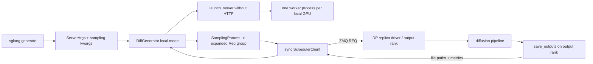

# Diffusion Generate CLI

`sglang generate` is the offline public surface for SGLang's separate
multimodal-generation runtime. It does not enter the language-model SRT
tokenizer/scheduler/detokenizer stack. The active class is named
`DiffGenerator`; older prose that calls it `DiffusionGenerator` is describing
the same role but not the symbol in this snapshot
([package export](https://github.com/EltonChang1/sglang/blob/f464e77d17a3908ad0ea32547b1e8b039bcbd354/python/sglang/multimodal_gen/__init__.py#L1-L6),
[`DiffGenerator`](https://github.com/EltonChang1/sglang/blob/f464e77d17a3908ad0ea32547b1e8b039bcbd354/python/sglang/multimodal_gen/runtime/entrypoints/diffusion_generator.py#L68-L145)).

This guide follows the installed command through model detection, two
configuration records, local worker launch, request expansion, synchronous ZMQ
transport, output persistence, metrics, and cleanup. Pipeline stages, model
families, caches, and accelerator kernels remain in Phase 7.

## Where the command actually enters

The `sglang` console script first recognizes only the word `generate` and
forwards every remaining token. The dedicated wrapper then:

1. handles help before requiring a model;
2. extracts `--model-path` or `--model`;
3. classifies the model as diffusion-capable; and
4. builds the diffusion parser and calls `generate_cmd`.

The classifier checks an overlay registry, the native diffusion registry, a
local `model_index.json`, and finally a downloaded Hub/ModelScope
`model_index.json`. Any remote detection error becomes `False`, after which
`generate` reports that the model is unsupported; there is no LLM generation
fallback for this command
([root wrapper](https://github.com/EltonChang1/sglang/blob/f464e77d17a3908ad0ea32547b1e8b039bcbd354/python/sglang/cli/generate.py#L6-L33),
[classifier](https://github.com/EltonChang1/sglang/blob/f464e77d17a3908ad0ea32547b1e8b039bcbd354/python/sglang/cli/utils.py#L18-L96)).

There is a second parser in
`multimodal_gen/runtime/entrypoints/cli/main.py`. Running that module directly
registers both `generate` and diffusion `serve`, but the installed console
script does not traverse it. Its hard-coded `0.1.0` version is therefore also
different from `sglang version`, which reads package and Git metadata
([secondary dispatcher](https://github.com/EltonChang1/sglang/blob/f464e77d17a3908ad0ea32547b1e8b039bcbd354/python/sglang/multimodal_gen/runtime/entrypoints/cli/main.py#L12-L44),
[root version command](https://github.com/EltonChang1/sglang/blob/f464e77d17a3908ad0ea32547b1e8b039bcbd354/python/sglang/cli/main.py#L7-L46)).

## Two configuration planes and their precedence

The parser combines `ServerArgs.add_cli_args` with
`SamplingParams.add_cli_args`. The two records answer different questions:

| Record | Lifetime and examples | Main consumer |
| --- | --- | --- |
| `ServerArgs` | Model/backend selection, process/rank layout, ports, warmup, loading, batching, tracing, default output directory | `DiffGenerator` construction and workers |
| model-specific `SamplingParams` subclass | Prompt/media, seed, dimensions, steps, output name/format, postprocessing, request-only controls | One or more `Req` objects |

One JSON or YAML config can contain fields for both records. The effective
precedence is:

```text
dataclass/model defaults < config file < explicitly supplied CLI flags
                         < --output-file-path alias < generated request UUID
```

`ServerArgs.from_cli_args` deliberately filters out argparse defaults, merges
the config beneath explicit CLI values, accepts only the special dynamic
component override syntax from unknown arguments, constructs a pipeline
configuration, adjusts defaults, and validates topology
([merge and construction](https://github.com/EltonChang1/sglang/blob/f464e77d17a3908ad0ea32547b1e8b039bcbd354/python/sglang/multimodal_gen/runtime/server_args/server_args.py#L2874-L2970),
[JSON/YAML loading](https://github.com/EltonChang1/sglang/blob/f464e77d17a3908ad0ea32547b1e8b039bcbd354/python/sglang/multimodal_gen/runtime/server_args/server_args.py#L2987-L3003)).

For the request plane, `generate_cmd` first selects the sampling subclass by an
explicit pipeline name, then by model-registry metadata, and finally falls back
to base `SamplingParams` if lookup fails. Config keys are admitted only when
they are dataclass fields of that selected class. Explicit sampling CLI values
then overwrite them; `--output-file-path` splits into directory and basename
last; and a fresh UUID overwrites any request ID
([sampling-class selection](https://github.com/EltonChang1/sglang/blob/f464e77d17a3908ad0ea32547b1e8b039bcbd354/python/sglang/multimodal_gen/runtime/entrypoints/cli/generate.py#L34-L57),
[request argument assembly](https://github.com/EltonChang1/sglang/blob/f464e77d17a3908ad0ea32547b1e8b039bcbd354/python/sglang/multimodal_gen/runtime/entrypoints/cli/generate.py#L154-L201)).

Three details are easy to miss:

- the parser exposes the base `SamplingParams` flag set even when a subclass is
  selected later, so a subclass-only field may be usable from config/Python but
  not as an ad hoc CLI flag;
- `--diffusers-kwargs` is parsed as JSON after ordinary sampling extraction and
  invalid JSON raises before model launch; and
- `--text-encoder-configs` is present only to raise `NotImplementedError`, not
  to accept and ignore a future option
  ([argument registration](https://github.com/EltonChang1/sglang/blob/f464e77d17a3908ad0ea32547b1e8b039bcbd354/python/sglang/multimodal_gen/runtime/entrypoints/cli/generate.py#L60-L93),
  [JSON branch](https://github.com/EltonChang1/sglang/blob/f464e77d17a3908ad0ea32547b1e8b039bcbd354/python/sglang/multimodal_gen/runtime/entrypoints/cli/generate.py#L180-L197)).

## End-to-end offline flow

The active path has a client process and one worker per local GPU. With default
`return_file_paths_only=True`, the output-rank worker persists the media and
returns paths rather than serializing full tensors back to the client.



Ordered control flow:

1. `generate_cmd` creates `DiffGenerator.from_pretrained(..., local_mode=True)`.
2. The constructor derives ports; `from_server_args` suppresses noisy loggers,
   initializes tracing, initializes the synchronous scheduler client, launches
   workers without HTTP, and optionally sends explicit warmup requests
   ([construction](https://github.com/EltonChang1/sglang/blob/f464e77d17a3908ad0ea32547b1e8b039bcbd354/python/sglang/multimodal_gen/runtime/entrypoints/diffusion_generator.py#L76-L162)).
3. `generate` resolves inline or file-based prompts, creates the model-specific
   sampling record, adjusts it against server/pipeline configuration, and
   converts each prompt to a `Req`
   ([prompt and request preparation](https://github.com/EltonChang1/sglang/blob/f464e77d17a3908ad0ea32547b1e8b039bcbd354/python/sglang/multimodal_gen/runtime/entrypoints/diffusion_generator.py#L195-L249)).
4. Each parent request expands into one request per requested output, with a
   distinct seed, request-ID suffix, output-index metadata, tracing context,
   and filename suffix
   ([expansion](https://github.com/EltonChang1/sglang/blob/f464e77d17a3908ad0ea32547b1e8b039bcbd354/python/sglang/multimodal_gen/runtime/entrypoints/utils.py#L259-L379)).
5. The synchronous client sends the group over a fresh ZMQ `REQ` socket and
   blocks for an `OutputBatch`. Ordinary work chooses one data-parallel replica;
   state-mutating control requests fan out to every replica
   ([routing](https://github.com/EltonChang1/sglang/blob/f464e77d17a3908ad0ea32547b1e8b039bcbd354/python/sglang/multimodal_gen/runtime/scheduler_client.py#L117-L197)).
6. The output rank either saves and returns file paths, returns mesh paths, or
   returns payloads that the client materializes. `DiffGenerator` validates
   that the scheduler returned exactly one output per expanded request and
   builds `GenerationResult`
   ([response branches](https://github.com/EltonChang1/sglang/blob/f464e77d17a3908ad0ea32547b1e8b039bcbd354/python/sglang/multimodal_gen/runtime/entrypoints/diffusion_generator.py#L276-L391)).
7. Video-owned queued resources are cleaned once per original prompt group in
   `finally`; successful results collapse to one object or remain a list
   ([cleanup and result shape](https://github.com/EltonChang1/sglang/blob/f464e77d17a3908ad0ea32547b1e8b039bcbd354/python/sglang/multimodal_gen/runtime/entrypoints/diffusion_generator.py#L392-L419)).

## Prompt and output expansion invariants

Prompt sources have strict priority. Request `prompt_path` wins over
`ServerArgs.prompt_file_path`; blank lines are removed; a missing or empty file
raises; an omitted inline prompt becomes one space rather than an empty list
([`_resolve_prompts`](https://github.com/EltonChang1/sglang/blob/f464e77d17a3908ad0ea32547b1e8b039bcbd354/python/sglang/multimodal_gen/runtime/entrypoints/diffusion_generator.py#L449-L470)).

Media pairing depends on prompt count:

| Prompts | `image_path` shape | Meaning |
| --- | --- | --- |
| one | string or list | pass the whole value to that prompt |
| many | string or one-item list | share it across prompts |
| many | list with one item per prompt | pair by position |
| many | any other multi-item length | reject as ambiguous |

A fixed `output_file_name` is forbidden for multiple prompts because it would
collide. Multiple outputs from one prompt are safe: integer seed `s` becomes
`s, s+1, ...`; a seed list may describe one prompt's outputs or the flattened
outputs of all prompts; and names become `name_0.ext`, `name_1.ext`, and so on
([image pairing and collision check](https://github.com/EltonChang1/sglang/blob/f464e77d17a3908ad0ea32547b1e8b039bcbd354/python/sglang/multimodal_gen/runtime/entrypoints/diffusion_generator.py#L177-L237),
[seed rules](https://github.com/EltonChang1/sglang/blob/f464e77d17a3908ad0ea32547b1e8b039bcbd354/python/sglang/multimodal_gen/runtime/entrypoints/utils.py#L259-L289)).

`dataclasses.replace` copies only declared fields. `generate` explicitly
restores the non-field `_explicit_fields` set so downstream validation can tell
that width, height, image path, and other user choices are intentional rather
than model defaults
([restoration](https://github.com/EltonChang1/sglang/blob/f464e77d17a3908ad0ea32547b1e8b039bcbd354/python/sglang/multimodal_gen/runtime/entrypoints/diffusion_generator.py#L230-L248)).

## Output naming and persistence

`SamplingParams` assigns an extension by `DataType`: image `png`, video `mp4`,
mesh `glb`, and action `json`. An absent name is derived from prompt, time, and
an eight-character hash, sanitized to an ASCII filesystem-safe form, and
joined to the request or server output directory
([type extensions and sanitizer](https://github.com/EltonChang1/sglang/blob/f464e77d17a3908ad0ea32547b1e8b039bcbd354/python/sglang/multimodal_gen/configs/sample/sampling_params.py#L60-L95),
[name construction](https://github.com/EltonChang1/sglang/blob/f464e77d17a3908ad0ea32547b1e8b039bcbd354/python/sglang/multimodal_gen/configs/sample/sampling_params.py#L306-L345)).

There are two persistence placements:

- **worker-side, the CLI default:** `save_output` and
  `return_file_paths_only` are both true. The output rank calls `save_outputs`,
  drops tensor/audio payloads, and returns only paths. This avoids large ZMQ
  serialization
  ([transport selection](https://github.com/EltonChang1/sglang/blob/f464e77d17a3908ad0ea32547b1e8b039bcbd354/python/sglang/multimodal_gen/runtime/managers/gpu_worker.py#L610-L652),
  [worker save](https://github.com/EltonChang1/sglang/blob/f464e77d17a3908ad0ea32547b1e8b039bcbd354/python/sglang/multimodal_gen/runtime/managers/gpu_worker.py#L762-L839)).
- **client-side payload branch:** when the scheduler returns samples, the
  generator materializes image/video frames, optionally interpolates and
  upscales them, saves if requested, and keeps samples/frames/audio in the
  result
  ([client branch](https://github.com/EltonChang1/sglang/blob/f464e77d17a3908ad0ea32547b1e8b039bcbd354/python/sglang/multimodal_gen/runtime/entrypoints/diffusion_generator.py#L339-L390),
  [materialization](https://github.com/EltonChang1/sglang/blob/f464e77d17a3908ad0ea32547b1e8b039bcbd354/python/sglang/multimodal_gen/runtime/entrypoints/utils.py#L1006-L1108)).

The saving layer preserves PNG pixels through Pillow, uses imageio/FFmpeg for
video, tries a CUDA-to-registered-memfd fast path, can encode audio in one pass,
and falls back to video-then-mux behavior. The memfd cache is process-global,
bounded at 1 GiB, locked, and released at exit
([direct video path](https://github.com/EltonChang1/sglang/blob/f464e77d17a3908ad0ea32547b1e8b039bcbd354/python/sglang/multimodal_gen/runtime/entrypoints/utils.py#L51-L159),
[`save_outputs`](https://github.com/EltonChang1/sglang/blob/f464e77d17a3908ad0ea32547b1e8b039bcbd354/python/sglang/multimodal_gen/runtime/entrypoints/utils.py#L1126-L1246)).

## Distributed launch behavior

Offline does not mean single process. Importing the generator module forces
Python multiprocessing to `spawn` to avoid inheriting CUDA state. Local mode
then starts `num_gpus // nnodes` workers on each node, maps local indices to a
global rank offset, creates local master/slave pipes, starts every worker before
waiting for readiness, and returns on node zero without starting FastAPI
([spawn selection](https://github.com/EltonChang1/sglang/blob/f464e77d17a3908ad0ea32547b1e8b039bcbd354/python/sglang/multimodal_gen/runtime/entrypoints/diffusion_generator.py#L58-L65),
[rank and readiness launch](https://github.com/EltonChang1/sglang/blob/f464e77d17a3908ad0ea32547b1e8b039bcbd354/python/sglang/multimodal_gen/runtime/launch_server.py#L171-L305)).

`ServerArgs` requires a natural node count, an in-range node rank, a
distributed initialization address for multiple nodes, and divisibility across
nodes and configured parallel groups. Nonzero nodes host workers only and block
joining them; node zero owns the offline client/HTTP-facing surface
([parallel validation](https://github.com/EltonChang1/sglang/blob/f464e77d17a3908ad0ea32547b1e8b039bcbd354/python/sglang/multimodal_gen/runtime/server_args/server_args.py#L3239-L3312),
[nonzero-node behavior](https://github.com/EltonChang1/sglang/blob/f464e77d17a3908ad0ea32547b1e8b039bcbd354/python/sglang/multimodal_gen/runtime/launch_server.py#L291-L305)).

Data parallelism is a transport distinction above worker-internal parallel
groups. `scheduler_endpoints` exposes one ingress endpoint per DP replica;
ordinary requests use round robin, realtime sessions hash to a stable replica,
and LoRA/weight/memory/shutdown controls fan out so success means every replica
succeeded
([endpoints](https://github.com/EltonChang1/sglang/blob/f464e77d17a3908ad0ea32547b1e8b039bcbd354/python/sglang/multimodal_gen/runtime/server_args/server_args.py#L2707-L2727),
[client policy](https://github.com/EltonChang1/sglang/blob/f464e77d17a3908ad0ea32547b1e8b039bcbd354/python/sglang/multimodal_gen/runtime/scheduler_client.py#L39-L53)).

The tempting `cli/utils.py::launch_distributed` function is not this path. No
tracked Python file calls it, and it constructs a torchrun command for
`python/sglang/sgl_diffusion/sample/v1_sgl_diffusion_inference.py`, a path not
present in the snapshot. Treat it as an unintegrated historical helper, not a
supported launcher
([helper](https://github.com/EltonChang1/sglang/blob/f464e77d17a3908ad0ea32547b1e8b039bcbd354/python/sglang/multimodal_gen/runtime/entrypoints/cli/utils.py#L22-L75)).

## Results, metrics, controls, and cleanup

`GenerationResult` carries prompt, logical size, generation time, peak memory,
stage metrics, optional samples/frames/audio/action/trajectory data, prompt
index, and output path. `--perf-dump-path` reconstructs the first result's
serialized `RequestMetrics` and writes one benchmark report tagged
`cli_generate`; no result or no metrics means no file
([result record](https://github.com/EltonChang1/sglang/blob/f464e77d17a3908ad0ea32547b1e8b039bcbd354/python/sglang/multimodal_gen/runtime/entrypoints/utils.py#L230-L248),
[performance dump](https://github.com/EltonChang1/sglang/blob/f464e77d17a3908ad0ea32547b1e8b039bcbd354/python/sglang/multimodal_gen/runtime/entrypoints/cli/generate.py#L108-L151)).

The Python API also exposes action generation and LoRA set/list/merge/unmerge
controls through the same scheduler client. Local `shutdown` requests graceful
scheduler exit with a five-second RPC deadline, joins workers for ten seconds,
then escalates through terminate and kill before closing the client. A context
manager gives deterministic cleanup; `__del__` is only a forceful last resort
and intentionally skips the graceful request
([action and LoRA methods](https://github.com/EltonChang1/sglang/blob/f464e77d17a3908ad0ea32547b1e8b039bcbd354/python/sglang/multimodal_gen/runtime/entrypoints/diffusion_generator.py#L421-L447),
[LoRA controls](https://github.com/EltonChang1/sglang/blob/f464e77d17a3908ad0ea32547b1e8b039bcbd354/python/sglang/multimodal_gen/runtime/entrypoints/diffusion_generator.py#L533-L673),
[shutdown](https://github.com/EltonChang1/sglang/blob/f464e77d17a3908ad0ea32547b1e8b039bcbd354/python/sglang/multimodal_gen/runtime/entrypoints/diffusion_generator.py#L675-L758)).

## Failure modes and operational checks

- Root model detection is fail-closed: network, access, malformed metadata, or
  missing optional diffusion imports can make a valid unregistered model look
  unsupported.
- Invalid config extension, missing config, unknown CLI arguments, malformed
  `diffusers_kwargs`, impossible parallelism, and failed worker readiness stop
  before generation.
- `DiffGenerator.generate` is annotated to accept `sampling_params_kwargs=None`
  but immediately calls `.get`; Python callers must pass a dictionary.
- Per-prompt scheduler and persistence exceptions are logged and swallowed.
  Other prompt groups may succeed; if none do, `generate` returns `None`.
  Because `generate_cmd` does not convert `None` into an exception, the CLI can
  finish without a nonzero exit solely for that condition. The end-to-end tests
  therefore check both subprocess success and file existence.
- A fixed filename with multiple prompts, ambiguous image pairing, invalid seed
  list length, output-count mismatch, missing output payload, output codec
  failure, and scheduler timeout all have explicit failure paths.
- The CLI does not use a `with DiffGenerator(...)` block. In ordinary CPython
  the local object is usually finalized when `generate_cmd` returns, but
  deterministic embedding code should use the context manager or call
  `shutdown` explicitly.

## What the focused tests prove

The lightweight tests cover prompt-file priority/errors, seed and filename
expansion, data-parallel routing, ZMQ deadlines/cancellation, worker shutdown
escalation, PNG fidelity, video/audio fallback, direct CUDA save behavior, and
the shared subprocess command builder. GPU end-to-end tests cover Z-Image
generation plus the output-file-path alias, and Qwen image editing across
single/multiple prompt and image shapes
([prompt tests](https://github.com/EltonChang1/sglang/blob/f464e77d17a3908ad0ea32547b1e8b039bcbd354/python/sglang/multimodal_gen/test/unit/test_resolve_prompts.py#L16-L96),
[CLI harness](https://github.com/EltonChang1/sglang/blob/f464e77d17a3908ad0ea32547b1e8b039bcbd354/python/sglang/multimodal_gen/test/single_test_file/cli_generate_common.py#L26-L119),
[image-edit matrix](https://github.com/EltonChang1/sglang/blob/f464e77d17a3908ad0ea32547b1e8b039bcbd354/python/sglang/multimodal_gen/test/single_test_file/test_generate_i2i.py#L17-L128)).

There is no isolated test for root model-detection dispatch, config-versus-CLI
sampling precedence, invalid `diffusers_kwargs`, performance-report selection,
the CLI's all-groups-failed exit status, or the unused torchrun helper. Live GPU
tests require model downloads and accelerator resources.

## Study checks

1. Explain why `sglang generate` and `sglang serve` can classify the same model
   but enter different wrappers.
2. Given one config value, one explicit CLI value, and
   `--output-file-path`, state which request field wins.
3. For two prompts and three outputs per prompt, derive request IDs, seeds, and
   filenames.
4. Identify where tensors stop moving over ZMQ in the default CLI path.
5. Contrast model/tensor/sequence parallel workers with DP request routing.
6. Explain why the legacy `launch_distributed` function is not evidence that
   the active CLI uses torchrun.
7. Name the cleanup path that is deterministic for library callers and the
   one that exists only as a finalizer safeguard.
