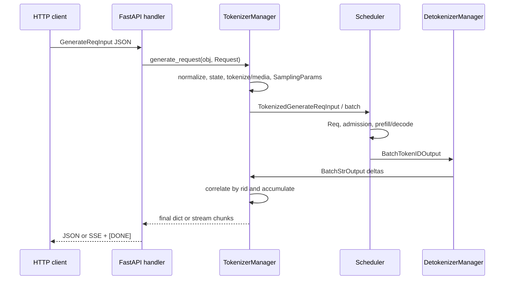

# Native `/generate` Protocol

The native `/generate` endpoint is the shortest HTTP route into SGLang's
language-model runtime. It accepts SGLang's own `GenerateReqInput` shape rather
than adapting an OpenAI, Anthropic, or Ollama schema. The Python HTTP handler is
small because the real protocol lives across request normalization,
`TokenizerManager`, scheduler request/output messages, and the separate
detokenizer process
([HTTP handler](https://github.com/EltonChang1/sglang/blob/f464e77d17a3908ad0ea32547b1e8b039bcbd354/python/sglang/srt/entrypoints/http_server.py#L889-L940),
[`GenerateReqInput`](https://github.com/EltonChang1/sglang/blob/f464e77d17a3908ad0ea32547b1e8b039bcbd354/python/sglang/srt/managers/io_struct.py#L162-L340)).

This guide follows the default Python server. The embedded Rust server shares
the scheduler request core but replaces Python HTTP, tokenization,
detokenization, and egress; its distinct wire protocol remains for Phase 8.

## Public request and response contract

`POST` and `PUT` are both registered. Unlike the OpenAI routes, `/generate`
does not attach the explicit `application/json` content-type dependency. FastAPI
still parses the body into the dataclass and rejects schema/type errors before
the handler runs
([native route](https://github.com/EltonChang1/sglang/blob/f464e77d17a3908ad0ea32547b1e8b039bcbd354/python/sglang/srt/entrypoints/http_server.py#L889-L897),
[OpenAI-only content-type dependency](https://github.com/EltonChang1/sglang/blob/f464e77d17a3908ad0ea32547b1e8b039bcbd354/python/sglang/srt/entrypoints/http_server.py#L636-L649)).

The most important request groups are:

| Group | Representative fields | Runtime meaning |
| --- | --- | --- |
| Prompt | `text`, `input_ids`, `input_embeds` | Raw text, already-tokenized IDs, or caller-supplied embeddings |
| Media | `image_data`, `video_data`, `audio_data`, hashes and tiling controls | Inputs for the model-specific multimodal processor |
| Sampling | `sampling_params` | Token budget, stops, penalties, filters, grammar, seed, stream interval, and `n` |
| Result detail | logprob fields, sampling mask, hidden states, routed experts, prompt IDs | Optional output metadata with server/backend restrictions |
| Routing | `rid`, DP/disaggregation fields, priority, routing/cache keys | Correlation, placement, queue policy, and cache isolation |
| Adaptation | `lora_path`, custom logit processor, positional embedding overrides | Per-request execution changes gated by server configuration |
| Lifecycle | `stream`, session fields, trace header, metrics/log flags | Response mode, continuation identity, observability, and privacy |

An ordinary successful result has this shape:

```json
{
  "text": "generated text",
  "output_ids": [123, 456],
  "meta_info": {
    "id": "request-id",
    "finish_reason": {"type": "length", "length": 2},
    "prompt_tokens": 8,
    "completion_tokens": 2,
    "cached_tokens": 0,
    "weight_version": "...",
    "num_retractions": 0
  }
}
```

Optional fields add logprobs, timing, DP rank, multimodal token counts, hidden
states, routed experts, indexer output, cache details, speculative metrics, or
customized sampler information. With `--skip-tokenizer-init`, text is absent
and the return path uses token IDs only
([result assembly](https://github.com/EltonChang1/sglang/blob/f464e77d17a3908ad0ea32547b1e8b039bcbd354/python/sglang/srt/managers/tokenizer_manager.py#L2194-L2392)).

## End-to-end control and data flow



Ordered flow:

1. The HTTP handler optionally overwrites routing fields from trusted headers,
   then chooses JSON or SSE response handling from `obj.stream`
   ([handler branch](https://github.com/EltonChang1/sglang/blob/f464e77d17a3908ad0ea32547b1e8b039bcbd354/python/sglang/srt/entrypoints/http_server.py#L895-L938)).
2. `TokenizerManager.generate_request` starts its result loop lazily,
   normalizes the request, assigns default priority, validates strict-thinking
   and DP routing, creates request state, waits through pause state, and takes
   the model-update lock's reader side
   ([manager ingress](https://github.com/EltonChang1/sglang/blob/f464e77d17a3908ad0ea32547b1e8b039bcbd354/python/sglang/srt/managers/tokenizer_manager.py#L767-L833)).
3. Text becomes token IDs, or provided IDs/embeddings bypass tokenization.
   Model-specific media processing can replace the token sequence and attach
   processor output. Length and feature-gate validation run before dispatch
   ([tokenization and media](https://github.com/EltonChang1/sglang/blob/f464e77d17a3908ad0ea32547b1e8b039bcbd354/python/sglang/srt/managers/tokenizer_manager.py#L958-L1126),
   [request validation](https://github.com/EltonChang1/sglang/blob/f464e77d17a3908ad0ea32547b1e8b039bcbd354/python/sglang/srt/managers/tokenizer_manager.py#L1159-L1250)).
4. Server-preferred sampling defaults are overlaid by request values. The
   tokenizer manager constructs, normalizes, and verifies `SamplingParams`,
   then creates `TokenizedGenerateReqInput`
   ([request construction](https://github.com/EltonChang1/sglang/blob/f464e77d17a3908ad0ea32547b1e8b039bcbd354/python/sglang/srt/managers/tokenizer_manager.py#L1333-L1415)).
5. The request is wrapped for shared-memory/media transport and sent over the
   scheduler-input channel. An optimized text batch may cross as one
   `BatchTokenizedGenerateReqInput`; the scheduler still admits its members
   individually
   ([dispatch](https://github.com/EltonChang1/sglang/blob/f464e77d17a3908ad0ea32547b1e8b039bcbd354/python/sglang/srt/managers/tokenizer_manager.py#L1554-L1607),
   [batch scheduler ingress](https://github.com/EltonChang1/sglang/blob/f464e77d17a3908ad0ea32547b1e8b039bcbd354/python/sglang/srt/managers/scheduler.py#L2731-L2740)).
6. The scheduler converts the transport record to mutable `Req` state, expands
   media placeholders, validates mode-specific options and prompt length, sets
   logprob offsets, passes grammar-bearing work to the grammar queue, and
   otherwise enters the ordinary/disaggregated waiting queue
   ([scheduler admission](https://github.com/EltonChang1/sglang/blob/f464e77d17a3908ad0ea32547b1e8b039bcbd354/python/sglang/srt/managers/scheduler.py#L2419-L2729)).
7. At stream intervals or completion, `SchedulerOutputStreamer` emits only the
   unsent token/logprob/custom-data suffix as `BatchTokenIDOutput`. The
   detokenizer turns that suffix into printable text and returns
   `BatchStrOutput`
   ([scheduler output selection](https://github.com/EltonChang1/sglang/blob/f464e77d17a3908ad0ea32547b1e8b039bcbd354/python/sglang/srt/managers/scheduler_components/output_streamer.py#L405-L475),
   [payload](https://github.com/EltonChang1/sglang/blob/f464e77d17a3908ad0ea32547b1e8b039bcbd354/python/sglang/srt/managers/scheduler_components/output_streamer.py#L655-L729),
   [detokenization](https://github.com/EltonChang1/sglang/blob/f464e77d17a3908ad0ea32547b1e8b039bcbd354/python/sglang/srt/managers/detokenizer_manager.py#L291-L488)).
8. The tokenizer manager finds `ReqState` by `rid`, accumulates text, IDs and
   optional metadata, deletes completed state, sets its event, and wakes the
   request coroutine. Pre-dispatch failures use a separate cleanup path so
   IDs do not remain falsely in flight
   ([correlation](https://github.com/EltonChang1/sglang/blob/f464e77d17a3908ad0ea32547b1e8b039bcbd354/python/sglang/srt/managers/tokenizer_manager.py#L2153-L2461),
   [state creation and failure cleanup](https://github.com/EltonChang1/sglang/blob/f464e77d17a3908ad0ea32547b1e8b039bcbd354/python/sglang/srt/managers/tokenizer_manager.py#L3358-L3415)).

The model forward pass, cache allocation, and scheduling policies lie between
steps 6 and 7. This guide establishes their request and result boundary; Phases
4 and 5 own those internals.

## Normalization is part of the wire protocol

`GenerateReqInput` is mutated in place before any work is sent. It determines
single versus batch shape, maps deprecated `data_parallel_rank` to
`routed_dp_rank`, rejects simultaneous `session_id` and `session_params`,
normalizes optional fields, generates IDs, and expands batch-shaped values
([normalization driver](https://github.com/EltonChang1/sglang/blob/f464e77d17a3908ad0ea32547b1e8b039bcbd354/python/sglang/srt/managers/io_struct.py#L342-L510),
[batch expansion](https://github.com/EltonChang1/sglang/blob/f464e77d17a3908ad0ea32547b1e8b039bcbd354/python/sglang/srt/managers/io_struct.py#L512-L836)).

Important invariants:

- Text strings and flat token-ID/embedding arrays are single inputs; outer
  lists make batches. Empty token-ID lists are rejected.
- A missing single `rid` becomes a UUID. A string `rid` on a batch becomes
  `rid_0`, `rid_1`, and so on. Duplicate IDs within a batch are rejected, and
  `_init_req_state` rejects an ID that is already in flight.
- `extra_key` and `cache_salt` normalize empty strings to `None`; batch lists
  must match the original batch length. They classify/cache requests without
  changing prompt tokens.
- A scalar image shared over a batch becomes one image per item. A flat image
  list means one image per prompt; a nested list means multiple images per
  prompt. Media hashes must align with normalized image counts.
- Per-item logprob modes and custom processors cannot be supplied as lists when
  parallel sampling is also requested, because the expansion would be
  ambiguous.
- `__getitem__` caches each per-item subobject. Later LoRA resolution can update
  already-created children instead of allowing different callers to observe
  divergent objects
  ([cached split](https://github.com/EltonChang1/sglang/blob/f464e77d17a3908ad0ea32547b1e8b039bcbd354/python/sglang/srt/managers/io_struct.py#L838-L941)).

There is a validation gap worth preserving in a source study: `_validate_inputs`
rejects none of the three prompt representations and rejects all three
together, but it does not reject exactly two. Normalization uses `text` first
to determine cardinality but clears only embeddings; it uses token IDs next
and also clears embeddings. Tokenization then checks embeddings, IDs, and text
in that order. Consequently IDs win over text when both are supplied, while
text or IDs discard simultaneously supplied embeddings. Text-plus-ID shapes
can even derive batch size from text while later consuming IDs. The error
message's claim that callers should provide one is therefore stricter—and
safer—than the code actually enforces
([input check](https://github.com/EltonChang1/sglang/blob/f464e77d17a3908ad0ea32547b1e8b039bcbd354/python/sglang/srt/managers/io_struct.py#L404-L431),
[cardinality and mutation](https://github.com/EltonChang1/sglang/blob/f464e77d17a3908ad0ea32547b1e8b039bcbd354/python/sglang/srt/managers/io_struct.py#L432-L460),
[tokenization branch](https://github.com/EltonChang1/sglang/blob/f464e77d17a3908ad0ea32547b1e8b039bcbd354/python/sglang/srt/managers/tokenizer_manager.py#L963-L997)).

## Sampling parameters: three transformations

Sampling values have three distinct stages:

1. `GenerateReqInput` uses `n` to choose single/batch behavior and normalize
   per-request dictionaries.
2. `TokenizerManager` merges server-preferred values below caller-supplied
   values. `max_thinking_tokens` becomes
   `custom_params["thinking_budget"]` after the strict-thinking gate.
3. `SamplingParams` converts nulls to defaults, turns near-zero temperature
   into greedy `top_k=1`, maps `-1` top-k to the whole vocabulary, converts stop
   aliases, computes stop-buffer lengths, and verifies numeric/vocabulary and
   mutually-exclusive grammar constraints
   ([merge and construction](https://github.com/EltonChang1/sglang/blob/f464e77d17a3908ad0ea32547b1e8b039bcbd354/python/sglang/srt/managers/tokenizer_manager.py#L1343-L1360),
   [`SamplingParams`](https://github.com/EltonChang1/sglang/blob/f464e77d17a3908ad0ea32547b1e8b039bcbd354/python/sglang/srt/sampling/sampling_params.py#L38-L254)).

String and regex stops, plus `min_new_tokens`, require a tokenizer. A server
started with `--skip-tokenizer-init` can generate from token IDs but must reject
those tokenizer-dependent features
([tokenizer requirement](https://github.com/EltonChang1/sglang/blob/f464e77d17a3908ad0ea32547b1e8b039bcbd354/python/sglang/srt/sampling/sampling_params.py#L299-L332)).

`n` is not a scheduler-side multi-choice primitive. For `n > 1`, the tokenizer
manager first sends a `max_new_tokens=0` request to warm/cache the common
prefix, then submits `n` independent copies with fresh generated IDs. A single
prompt therefore returns a list, and a batch returns `batch_size * n` results
in prompt-major generator order
([parallel sampling path](https://github.com/EltonChang1/sglang/blob/f464e77d17a3908ad0ea32547b1e8b039bcbd354/python/sglang/srt/managers/tokenizer_manager.py#L1835-L1899)).

That branch has two source-visible lifecycle hazards in this snapshot:

- normalization can create more parent `rid_to_state` entries than the branch
  later deletes; and
- actual choice requests receive unrelated UUIDs, while the HTTP background
  abort task later aborts the normalized parent IDs.

As a result, disconnected parallel-sampling streams do not have the same clear
ID-to-abort relationship as `n == 1`. The focused normalization and cleanup
tests do not exercise this combined case
([state initialization uses normalized ID count](https://github.com/EltonChang1/sglang/blob/f464e77d17a3908ad0ea32547b1e8b039bcbd354/python/sglang/srt/managers/tokenizer_manager.py#L3376-L3401),
[choice ID regeneration](https://github.com/EltonChang1/sglang/blob/f464e77d17a3908ad0ea32547b1e8b039bcbd354/python/sglang/srt/managers/tokenizer_manager.py#L1844-L1890),
[HTTP cleanup IDs](https://github.com/EltonChang1/sglang/blob/f464e77d17a3908ad0ea32547b1e8b039bcbd354/python/sglang/srt/managers/tokenizer_manager.py#L2114-L2126)).

## Tokenizer and multimodal preparation

Text tokenization chooses the asynchronous dynamic-batch tokenizer only for a
single string. Otherwise it uses the ordinary tokenizer, with a per-string
fallback for non-fast tokenizers. Provided `input_ids` skip this work; provided
`input_embeds` additionally require radix caching to be disabled because the
embedding vectors do not supply stable token-prefix cache identity
([tokenizer selection](https://github.com/EltonChang1/sglang/blob/f464e77d17a3908ad0ea32547b1e8b039bcbd354/python/sglang/srt/managers/tokenizer_manager.py#L835-L956),
[embedding restriction](https://github.com/EltonChang1/sglang/blob/f464e77d17a3908ad0ea32547b1e8b039bcbd354/python/sglang/srt/managers/tokenizer_manager.py#L958-L987)).

Multimodal requests are model- and deployment-sensitive. The tokenizer side:

- rejects media when the server is language-model-only;
- enforces per-modality item limits;
- lets the processor replace or pad token IDs and attach features;
- reconciles caller content hashes with hashes embedded in `ImageData`;
- can accept external feature hashes for router/cache-key alignment, but falls
  back to internal hashing on malformed entries; and
- prepares feature transport before scheduler dispatch, cancelling the
  transport reservation if dispatch fails
  ([media preparation](https://github.com/EltonChang1/sglang/blob/f464e77d17a3908ad0ea32547b1e8b039bcbd354/python/sglang/srt/managers/tokenizer_manager.py#L999-L1157),
  [transport cleanup](https://github.com/EltonChang1/sglang/blob/f464e77d17a3908ad0ea32547b1e8b039bcbd354/python/sglang/srt/managers/tokenizer_manager.py#L1554-L1607)).

The scheduler may expand one media placeholder into many model input tokens.
It performs another length check after this expansion, so a request that passed
the tokenizer-side raw length check can still fail at scheduler admission
([scheduler media expansion](https://github.com/EltonChang1/sglang/blob/f464e77d17a3908ad0ea32547b1e8b039bcbd354/python/sglang/srt/managers/scheduler.py#L2618-L2660)).

## Correlation, batching, and streaming shapes

`ReqState` is the tokenizer side's correlation record. It owns the wake event,
queued result objects, completion flag, timing, accumulated text and IDs, and
optional logprob/customized-data accumulators. Scheduler and detokenizer
payloads can batch unrelated request IDs; `_handle_batch_output` handles each
ID independently and wakes waiters in bounded groups
([state record](https://github.com/EltonChang1/sglang/blob/f464e77d17a3908ad0ea32547b1e8b039bcbd354/python/sglang/srt/managers/tokenizer_manager.py#L216-L298),
[batch result loop](https://github.com/EltonChang1/sglang/blob/f464e77d17a3908ad0ea32547b1e8b039bcbd354/python/sglang/srt/managers/tokenizer_manager.py#L2168-L2461)).

Response cardinality and order are protocol-visible:

| Request | Non-streaming body | Streaming event |
| --- | --- | --- |
| single, `n=1` | one result object | result chunks |
| batch, `n=1` | list in input order | interleaved chunks with `index` |
| single, `n>1` | list of choices | interleaved choice chunks with `index` |
| batch, `n>1` | flattened result list | interleaved flattened chunks with `index` |

Non-streaming batch collection waits for every first/final item and cancels
sibling waiter tasks if one fails. Streaming uses one pending `__anext__` task
per item, yields whichever completes first, annotates it with the generator's
stable index, and closes every generator in `finally`
([batch collection](https://github.com/EltonChang1/sglang/blob/f464e77d17a3908ad0ea32547b1e8b039bcbd354/python/sglang/srt/managers/tokenizer_manager.py#L1892-L1943)).

The detokenizer always produces text deltas. It keeps a bounded per-request
decode state, uses surrounding tokens to avoid subword-boundary corruption,
withholds incomplete replacement-character tails, trims matched stops, and
deletes state on finish
([decode state](https://github.com/EltonChang1/sglang/blob/f464e77d17a3908ad0ea32547b1e8b039bcbd354/python/sglang/srt/managers/detokenizer_manager.py#L57-L89),
[incremental decode](https://github.com/EltonChang1/sglang/blob/f464e77d17a3908ad0ea32547b1e8b039bcbd354/python/sglang/srt/managers/detokenizer_manager.py#L291-L410)).

What the client sees depends on `--incremental-streaming-output`:

- **default cumulative mode:** intermediate `text` and `output_ids` represent
  the complete prefix so far; text materialization is deferred to avoid
  rebuilding it on every scheduler step;
- **incremental mode:** each result contains only the new text, IDs, logprobs,
  sampling mask, and customized-data suffix. Multiple queued deltas are
  coalesced without dropping IDs
  ([waiter shaping](https://github.com/EltonChang1/sglang/blob/f464e77d17a3908ad0ea32547b1e8b039bcbd354/python/sglang/srt/managers/tokenizer_manager.py#L1609-L1782),
  [output shaping](https://github.com/EltonChang1/sglang/blob/f464e77d17a3908ad0ea32547b1e8b039bcbd354/python/sglang/srt/managers/tokenizer_manager.py#L2298-L2386)).

Each HTTP event is `data: <json>\n\n`; successful completion adds
`data: [DONE]\n\n`. A streaming `ValueError` becomes an in-band error event and
then `[DONE]`. A disconnect detected inside the stream path stops without
emitting either. Non-streaming returns the final object directly; a runtime
`ValueError` becomes `{"error":{"message":...}}` with its status code or 400
([HTTP stream and error contract](https://github.com/EltonChang1/sglang/blob/f464e77d17a3908ad0ea32547b1e8b039bcbd354/python/sglang/srt/entrypoints/http_server.py#L901-L938),
[non-stream error helper](https://github.com/EltonChang1/sglang/blob/f464e77d17a3908ad0ea32547b1e8b039bcbd354/python/sglang/srt/entrypoints/http_server.py#L2072-L2076)).

## Cancellation and explicit abort

There are three cancellation paths:

1. `_wait_one_response` checks `request.is_disconnected()` every request-state
   wait timeout (four seconds by default), both while queued and after
   intermediate non-stream output. It sends `AbortReq` and raises to unwind
   the request
   ([disconnect checks](https://github.com/EltonChang1/sglang/blob/f464e77d17a3908ad0ea32547b1e8b039bcbd354/python/sglang/srt/managers/tokenizer_manager.py#L1687-L1793),
   [default interval](https://github.com/EltonChang1/sglang/blob/f464e77d17a3908ad0ea32547b1e8b039bcbd354/python/sglang/srt/environ.py#L1218-L1218)).
2. A streaming response registers a background task. Two seconds after the
   response ends, it unconditionally sends aborts for the normalized request
   IDs. The scheduler/tokenizer-side guards make the common already-finished
   case a no-op
   ([background cleanup](https://github.com/EltonChang1/sglang/blob/f464e77d17a3908ad0ea32547b1e8b039bcbd354/python/sglang/srt/managers/tokenizer_manager.py#L2114-L2126),
   [local guard](https://github.com/EltonChang1/sglang/blob/f464e77d17a3908ad0ea32547b1e8b039bcbd354/python/sglang/srt/managers/tokenizer_manager.py#L1945-L1962)).
3. `POST /abort_request` accepts `rid` or `abort_all`. Scheduler matching is by
   request-ID prefix, allowing one prefix to stop derived requests. Empty ID is
   refused unless `abort_all=true`, because every string starts with an empty
   prefix
   ([HTTP control](https://github.com/EltonChang1/sglang/blob/f464e77d17a3908ad0ea32547b1e8b039bcbd354/python/sglang/srt/entrypoints/http_server.py#L1608-L1618),
   [scheduler abort matching](https://github.com/EltonChang1/sglang/blob/f464e77d17a3908ad0ea32547b1e8b039bcbd354/python/sglang/srt/managers/scheduler.py#L4572-L4621)).

An abort can arrive as an ordinary finished generation batch or as a direct
`AbortReq` echo. The tokenizer manager tolerates the race where normal
completion already removed state, converts the winning abort to a terminal
result, wakes the waiter, and permits later reuse of the same ID
([abort correlation](https://github.com/EltonChang1/sglang/blob/f464e77d17a3908ad0ea32547b1e8b039bcbd354/python/sglang/srt/managers/tokenizer_manager.py#L3150-L3205)).

`/abort_request` returning HTTP 200 means the abort message was accepted for
dispatch, not that a matching request existed or that accelerator work has
already stopped.

## Failure modes and operational checks

- Header overrides are disabled by default. When enabled, eight trusted
  headers overwrite body routing/priority fields; malformed integer values
  fail with HTTP 400. Deployments must strip these headers from untrusted
  clients or leave the mechanism off
  ([header map](https://github.com/EltonChang1/sglang/blob/f464e77d17a3908ad0ea32547b1e8b039bcbd354/python/sglang/srt/entrypoints/request_headers.py#L9-L33)).
- Prompt length is checked before dispatch and again after scheduler-side media
  expansion. `--allow-auto-truncate` changes rejection into input or output
  budget mutation; `--validate-total-tokens` controls the pre-dispatch
  input-plus-output check.
- Sampling errors include non-finite/out-of-range filters and penalties,
  invalid logit-bias token IDs, conflicting grammar types, tokenizer-dependent
  stops without a tokenizer, and regex parse failures.
- Feature requests are configuration-dependent: custom logit processors,
  hidden states, sampling masks, media, LoRA, strict thinking, DP rank, and
  disaggregation fields all have explicit rejection paths.
- Detokenizer state is capped by `SGLANG_DETOKENIZER_MAX_STATES` (65,536 by
  default). Evicting an active ID makes a later chunk fatal and reports how to
  raise the limit
  ([bounded state failure](https://github.com/EltonChang1/sglang/blob/f464e77d17a3908ad0ea32547b1e8b039bcbd354/python/sglang/srt/managers/detokenizer_manager.py#L57-L61),
  [missing-state error](https://github.com/EltonChang1/sglang/blob/f464e77d17a3908ad0ea32547b1e8b039bcbd354/python/sglang/srt/managers/detokenizer_manager.py#L359-L373)).
- Non-stream clients should not assume intermediate progress: scheduler
  force-flushes can carry liveness/metrics internally, but tokenizer-side
  shaping suppresses them until finish.
- Consumers must use `index` for batch streams and must know whether server
  streaming is cumulative or incremental before concatenating text.

## What the focused tests prove

The source has strong unit coverage for normalization and sampling, plus GPU
integration coverage for selected endpoint features:

- `test_io_struct.py` exercises media/batch/parallel expansion, IDs, per-item
  splits, logprob controls, LoRA, sessions, cache keys, and tokenized
  multimodal message round trips.
- `test_sampling_params.py` exhaustively checks default conversion, numeric and
  grammar validation, stop normalization, message serialization, and the regex
  buffer-length estimator.
- `test_tokenizer_manager_rid_cleanup.py` proves completion/abort/pre-dispatch
  cleanup, duplicate-ID protection, waiter cancellation, and strict-thinking
  rejection.
- `test_srt_endpoint.py` exercises native text/token inputs, chunked logprobs,
  grammar/logit-bias/custom-processor behavior, cache counts, and a batched
  native request against both Python and—where built—Rust egress.
- focused tests cover header overrides, stop trimming, incremental customized
  metadata, multi-tokenizer abort routing, explicit aborts, token-ID logprob
  validation, and sequential/concurrent/batch ID reuse
  ([normalization suite](https://github.com/EltonChang1/sglang/blob/f464e77d17a3908ad0ea32547b1e8b039bcbd354/test/registered/unit/managers/test_io_struct.py#L365-L1112),
  [sampling suite](https://github.com/EltonChang1/sglang/blob/f464e77d17a3908ad0ea32547b1e8b039bcbd354/test/registered/unit/sampling/test_sampling_params.py#L24-L535),
  [request-state suite](https://github.com/EltonChang1/sglang/blob/f464e77d17a3908ad0ea32547b1e8b039bcbd354/test/registered/unit/managers/test_tokenizer_manager_rid_cleanup.py#L218-L613),
  [endpoint suite](https://github.com/EltonChang1/sglang/blob/f464e77d17a3908ad0ea32547b1e8b039bcbd354/test/registered/core/test_srt_endpoint.py#L40-L719)).

Important gaps remain: no focused test combines native HTTP streaming, batch
input, and `n > 1`; no end-to-end test closes the client connection and proves
the generated scheduler IDs are cancelled; the native SSE error framing is not
isolated; and the Ascend abort test prints responses without asserting them.

## Study checks

1. Predict whether each prompt representation becomes a single request or a
   batch before reading `normalize_batch_and_arguments`.
2. Trace one `rid` through `ReqState`, `TokenizedGenerateReqInput`, scheduler
   `Req`, `BatchTokenIDOutput`, `BatchStrOutput`, and `meta_info.id`.
3. Explain why detokenizer output is a delta even when the HTTP client sees a
   cumulative prefix.
4. Compare request `n` expansion with scheduler continuous batching; they are
   separate kinds of batching.
5. Test a stop string that spans tokens and explain why the scheduler delays a
   prefix that might become a stop.
6. Compare explicit `/abort_request` with disconnect detection and the delayed
   streaming background abort.
7. Before using optional metadata, identify both its server flag and its
   per-request validation/admission restriction.
