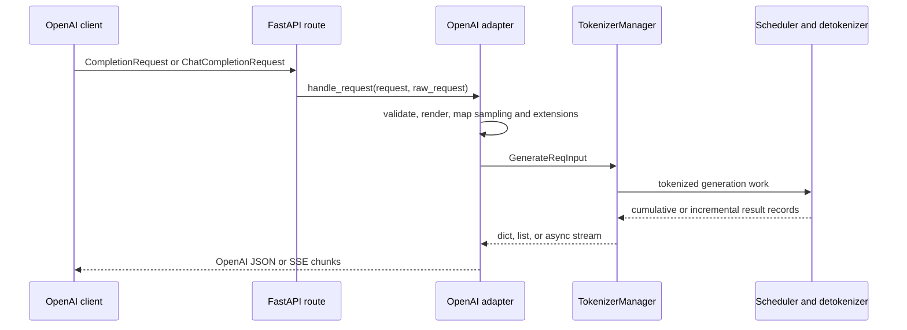

# OpenAI Completions and Chat Completions

SGLang's Python server exposes OpenAI-compatible text completions at
[/v1/completions](https://github.com/EltonChang1/sglang/blob/f464e77d17a3908ad0ea32547b1e8b039bcbd354/python/sglang/srt/entrypoints/http_server.py#L1715-L1720)
and chat completions at
[/v1/chat/completions](https://github.com/EltonChang1/sglang/blob/f464e77d17a3908ad0ea32547b1e8b039bcbd354/python/sglang/srt/entrypoints/http_server.py#L1723-L1730).
They are adapters above the native generation protocol, not separate inference
engines. Each validates an OpenAI-shaped request, prepares a
[GenerateReqInput](https://github.com/EltonChang1/sglang/blob/f464e77d17a3908ad0ea32547b1e8b039bcbd354/python/sglang/srt/managers/io_struct.py#L162-L340),
delegates to TokenizerManager, and reshapes the native result into OpenAI JSON
or server-sent events.

This guide covers the two completion adapters in the default Python server.
The Responses API, embeddings, scoring, transcription, Realtime API, native
Rust server, gateway, and model-specific parser implementations have separate
later passes.

## Where the compatibility layer sits

The handlers are constructed after TokenizerManager and TemplateManager are
available. Completion always uses OpenAIServingCompletion; chat uses
TokenizerManager.serving_chat_class, which permits a model-specific subclass
([handler construction](https://github.com/EltonChang1/sglang/blob/f464e77d17a3908ad0ea32547b1e8b039bcbd354/python/sglang/srt/entrypoints/http_server.py#L302-L310)).
This matters because the base chat path deliberately provides overridable
encoding and response-decoding hooks.

## The shared adapter lifecycle

[OpenAIServingBase.handle_request](https://github.com/EltonChang1/sglang/blob/f464e77d17a3908ad0ea32547b1e8b039bcbd354/python/sglang/srt/entrypoints/openai/serving_base.py#L73-L133)
owns the common order:

1. Record a monotonic receive time before adapter validation.
2. Run the endpoint-specific validator and return an OpenAI-shaped 400 if it
   produces a message.
3. Log the raw OpenAI request, when level-two request logging is enabled,
   before it is transformed or tokenized.
4. Convert it to GenerateReqInput and attach the receive timestamp.
5. Choose streaming from the request's stream flag, not from the adapted
   object's eventual normalized shape.
6. Translate HTTPException, ValueError, DeepSeek-3.2 encoding errors, and
   unexpected exceptions into structured error responses.

The error body is an ErrorResponse with object, message, type, param, and
numeric code. Pre-stream validation can therefore use an HTTP error status.
Once response headers have been sent, failures become in-band SSE data with an
error object instead
([error builders](https://github.com/EltonChang1/sglang/blob/f464e77d17a3908ad0ea32547b1e8b039bcbd354/python/sglang/srt/entrypoints/openai/serving_base.py#L196-L228)).
Both streaming handlers prime their async generator before creating the
StreamingResponse, so tokenizer or context validation still has a chance to
return HTTP 400 instead of an apparently successful stream
([completion priming](https://github.com/EltonChang1/sglang/blob/f464e77d17a3908ad0ea32547b1e8b039bcbd354/python/sglang/srt/entrypoints/openai/serving_completions.py#L192-L218),
[chat priming](https://github.com/EltonChang1/sglang/blob/f464e77d17a3908ad0ea32547b1e8b039bcbd354/python/sglang/srt/entrypoints/openai/serving_chat.py#L1514-L1540)).

Three header-derived values cross the adapter boundary:

- an allowlisted JSON object of custom metrics labels;
- x-smg-routing-key; and
- X-Data-Parallel-Rank, which must parse as an integer and overrides the body
  routed_dp_rank
  ([header helpers](https://github.com/EltonChang1/sglang/blob/f464e77d17a3908ad0ea32547b1e8b039bcbd354/python/sglang/srt/entrypoints/openai/serving_base.py#L230-L293)).

The model field can also select a LoRA as base-model:adapter. Splitting occurs
at the first colon, whitespace is stripped, and a non-empty adapter from the
model string overrides the explicit lora_path. The base-model portion is not
used to replace the served model here; the helper exists to resolve adapter
identity
([LoRA helpers](https://github.com/EltonChang1/sglang/blob/f464e77d17a3908ad0ea32547b1e8b039bcbd354/python/sglang/srt/entrypoints/openai/serving_base.py#L40-L71)).

## Text completions

### Request mapping

[CompletionRequest](https://github.com/EltonChang1/sglang/blob/f464e77d17a3908ad0ea32547b1e8b039bcbd354/python/sglang/srt/entrypoints/openai/protocol.py#L328-L415)
accepts a string, a batch of strings, one flat token-ID prompt, or a batch of
token-ID prompts. Pydantic rejects a missing prompt and non-positive
max_tokens. The handler additionally rejects an empty prompt or a list whose
members are all empty
([completion validation](https://github.com/EltonChang1/sglang/blob/f464e77d17a3908ad0ea32547b1e8b039bcbd354/python/sglang/srt/entrypoints/openai/serving_completions.py#L60-L66)).

The adapter optionally applies a configured code-completion template, maps
string prompts to text and token prompts to input_ids, and constructs native
sampling fields. The important name changes are max_tokens to max_new_tokens,
seed to sampling_seed, and response_format to a JSON-schema or structural-tag
constraint
([conversion](https://github.com/EltonChang1/sglang/blob/f464e77d17a3908ad0ea32547b1e8b039bcbd354/python/sglang/srt/entrypoints/openai/serving_completions.py#L68-L142),
[sampling map](https://github.com/EltonChang1/sglang/blob/f464e77d17a3908ad0ea32547b1e8b039bcbd354/python/sglang/srt/entrypoints/openai/serving_completions.py#L144-L190)).
Legacy json_schema, regex, and EBNF fields remain available beside
response_format; the downstream SamplingParams verifier owns mutual
exclusivity.

Echo is response shaping rather than another model call. The adapter decodes
token prompts when necessary and prepends the appropriate prompt to each
choice using index // n to recover prompt ownership
([streaming echo](https://github.com/EltonChang1/sglang/blob/f464e77d17a3908ad0ea32547b1e8b039bcbd354/python/sglang/srt/entrypoints/openai/serving_completions.py#L275-L325),
[non-streaming echo](https://github.com/EltonChang1/sglang/blob/f464e77d17a3908ad0ea32547b1e8b039bcbd354/python/sglang/srt/entrypoints/openai/serving_completions.py#L537-L596)).
With echo and logprobs, logprob_start_len becomes zero and input logprobs are
included in the formatted result, even though the warning text says prompt
logprobs are not compatible and recommends the native endpoint. Treat that
warning as compatibility guidance, not as a faithful description of the
actual request fields.

Several OpenAI-schema fields are accepted but not consumed in this adapter:
best_of, suffix, user, and session_params do not appear in conversion or
response shaping. The body custom_labels field is also not forwarded; only
the configured header is used. This is compatibility-by-acceptance, not
feature implementation.

### Completion output

Non-streaming generation takes the first item yielded by TokenizerManager,
normalizes it to a list, then returns one flattened choice per native result
([non-streaming path](https://github.com/EltonChang1/sglang/blob/f464e77d17a3908ad0ea32547b1e8b039bcbd354/python/sglang/srt/entrypoints/openai/serving_completions.py#L501-L525)).
Each choice may contain text, legacy completion logprobs, matched stop, hidden
states, output IDs, and prompt IDs. Response-level metadata carries the first
result's weight version. The sglext object carries routed-expert, cache-detail,
and speculative-decoding data only when requested
([response builder](https://github.com/EltonChang1/sglang/blob/f464e77d17a3908ad0ea32547b1e8b039bcbd354/python/sglang/srt/entrypoints/openai/serving_completions.py#L527-L639)).

Streaming tracks offsets per flattened choice. In cumulative native mode it
slices text, token IDs, and logprobs after their previous offsets; in
incremental mode those values are already deltas and are passed through.
An abort with an HTTPStatus is emitted as an error event and stops native
iteration. A graceful abort without status code remains an ordinary terminal
choice. Optional hidden-state, sglext, and final usage records are separate
chunks, followed by data: [DONE]
([stream loop](https://github.com/EltonChang1/sglang/blob/f464e77d17a3908ad0ea32547b1e8b039bcbd354/python/sglang/srt/entrypoints/openai/serving_completions.py#L220-L499)).

## Chat completions

Chat adds two transformations around the same generation core: messages must
be rendered to a prompt, and model text may need to be separated into
reasoning, visible content, and tool calls.

### Schema and early validation

[ChatCompletionRequest](https://github.com/EltonChang1/sglang/blob/f464e77d17a3908ad0ea32547b1e8b039bcbd354/python/sglang/srt/entrypoints/openai/protocol.py#L823-L1173)
supports user, system, developer, assistant, tool, function, and
latest-reminder roles; ordered text, thinking, image, video, audio, and tool
reference content parts; tool definitions and tool choice; reasoning controls;
structured output; multimodal processor options; native routing and result
extensions; and precomputed input_ids.

Important schema normalization happens before the handler:

- roles are case-insensitive but normalized to lower case;
- thinking/reasoning content parts require exactly one payload and are valid
  only in assistant messages;
- inline wav or mp3 input_audio becomes a data URI;
- tool_choice defaults to none without tools and auto with request-level or
  system/developer message-level tools;
- nested reasoning inputs normalize into reasoning_effort and default both
  thinking and enable_thinking template flags without overriding explicit
  flags; and
- the legacy top-level schema response format is migrated into the nested
  json_schema shape
  ([message and tool schemas](https://github.com/EltonChang1/sglang/blob/f464e77d17a3908ad0ea32547b1e8b039bcbd354/python/sglang/srt/entrypoints/openai/protocol.py#L531-L820),
  [request validators](https://github.com/EltonChang1/sglang/blob/f464e77d17a3908ad0ea32547b1e8b039bcbd354/python/sglang/srt/entrypoints/openai/protocol.py#L959-L1071)).

Handler validation rejects empty messages, sampling-mask output without
meta_info, media for text-only models, required or named tool choices without
matching tools, duplicate message/request tool names, invalid or cyclic JSON
schemas, an output-token cap above server context length when auto-truncation
is disabled, and a json_schema response format without a schema
([chat validation](https://github.com/EltonChang1/sglang/blob/f464e77d17a3908ad0ea32547b1e8b039bcbd354/python/sglang/srt/entrypoints/openai/serving_chat.py#L852-L963)).
Streaming additionally rejects prompt IDs, response IDs, and meta_info because
that endpoint only implements those extensions in non-streaming responses
([stream-only checks](https://github.com/EltonChang1/sglang/blob/f464e77d17a3908ad0ea32547b1e8b039bcbd354/python/sglang/srt/entrypoints/openai/serving_chat.py#L965-L1000)).

### Message-to-prompt preparation

[OpenAIServingChat._process_messages](https://github.com/EltonChang1/sglang/blob/f464e77d17a3908ad0ea32547b1e8b039bcbd354/python/sglang/srt/entrypoints/openai/serving_chat.py#L1099-L1203)
is the chat-specific ingress hub:

1. Merge server default chat-template kwargs below per-request values and
   derive the request's reasoning mode.
2. Gather tools from the request and system/developer messages.
3. When a tool parser is configured, ask it for a structural constraint. For
   required or named calls without a native constraint, fall back to a JSON
   schema describing the allowed tool-call array.
4. If input_ids were supplied, bypass rendering and tokenization while still
   deriving stops, tool constraints, and reasoning requirements.
5. Otherwise choose the model's Hugging Face/Jinja template, a named
   conversation template, or a custom encoder.
6. Return prompt text or IDs, extracted media, modalities, stops, constraint,
   skip-special-token policy, and the require_reasoning bit as one
   MessageProcessingResult.

[chat_encoding.resolve_chat_encoding_spec](https://github.com/EltonChang1/sglang/blob/f464e77d17a3908ad0ea32547b1e8b039bcbd354/python/sglang/srt/entrypoints/openai/chat_encoding.py#L108-L143)
centralizes model dispatch. Parser configuration has priority, followed by
architecture detection. DeepSeek V4, DeepSeek V3.2 without a tokenizer
template, Kimi K3, and Inkling can bypass the generic template path.
Custom encoders own reasoning-history framing; generic templates rely on the
reasoning parser's wrapping policy
([reasoning-history rule](https://github.com/EltonChang1/sglang/blob/f464e77d17a3908ad0ea32547b1e8b039bcbd354/python/sglang/srt/entrypoints/openai/chat_encoding.py#L146-L157)).

The generic Jinja path converts multimodal content to the template's expected
format, flattens all-text tool results, parses assistant-history tool
arguments from JSON strings to objects, and tries OpenAI-wrapped tool schemas
before a flat function-only fallback. It renders first and encodes second so
tokenizers that auto-add specials can avoid a duplicate BOS. Jinja and known
Mistral template failures become client ValueErrors
([Jinja preparation](https://github.com/EltonChang1/sglang/blob/f464e77d17a3908ad0ea32547b1e8b039bcbd354/python/sglang/srt/entrypoints/openai/serving_chat.py#L1205-L1446)).
Named conversation templates instead build a Conversation prompt and merge
template stops with request stops
([conversation path](https://github.com/EltonChang1/sglang/blob/f464e77d17a3908ad0ea32547b1e8b039bcbd354/python/sglang/srt/entrypoints/openai/serving_chat.py#L1448-L1512)).

continue_final_message is a prefill feature, not an extra history turn. For a
plain trailing assistant string, the renderer removes or opens the terminal
assistant frame and appends the content without a closing boundary. Without
the flag, the generic Jinja helper converts a final assistant string to a
user message before requesting a new assistant generation
([generic last-message rule](https://github.com/EltonChang1/sglang/blob/f464e77d17a3908ad0ea32547b1e8b039bcbd354/python/sglang/srt/entrypoints/openai/serving_chat.py#L342-L396)).
Model-specific encoders impose stricter conditions; for example Inkling will
not continue a tool-call or reasoning-bearing assistant turn.

### Sampling and native handoff

Chat sampling precedence is request value, then the model generation config,
then OpenAI-compatible defaults. max_completion_tokens wins over max_tokens.
Stops come from rendered messages plus request settings. Tool-call and
response-format constraints cannot both be honored for required/named tools;
auto tool choice keeps the caller's ordinary output constraint and logs a
warning
([sampling conversion](https://github.com/EltonChang1/sglang/blob/f464e77d17a3908ad0ea32547b1e8b039bcbd354/python/sglang/srt/entrypoints/openai/protocol.py#L1073-L1173)).
A strict-false JSON schema may remain unconstrained only when a custom renderer
actually receives response_format; generic templates still constrain it
because otherwise the model never sees the format request.

Conversion chooses text or input IDs according to the rendering and
multimodal path, carries media and processor options, maps logprob, sampling,
routing, LoRA, session, result-detail, cache, priority, and reasoning fields,
then optionally applies trusted request-header overrides
([native construction](https://github.com/EltonChang1/sglang/blob/f464e77d17a3908ad0ea32547b1e8b039bcbd354/python/sglang/srt/entrypoints/openai/serving_chat.py#L965-L1097)).
From this point the native request normalization, tokenizer/media processing,
scheduler, detokenizer, request correlation, and abort machinery described in
[Native /generate Protocol](07-native-generate-protocol.md) apply.

## Chat output, reasoning, and tools

For non-streaming output, each native result can pass through a reasoning
parser first and a function-call parser second. The visible ChatMessage then
contains separate reasoning_content, ordinary content, and tool_calls.
Required/named tool choice uses a model-specific native parser when its
detector owns the output format; otherwise it parses the constrained JSON
array. A successfully parsed natural stop becomes finish_reason tool_calls.
Malformed parser output is logged and returned as visible text rather than
inventing a tool call
([response assembly](https://github.com/EltonChang1/sglang/blob/f464e77d17a3908ad0ea32547b1e8b039bcbd354/python/sglang/srt/entrypoints/openai/serving_chat.py#L1833-L2010),
[tool-call parsing](https://github.com/EltonChang1/sglang/blob/f464e77d17a3908ad0ea32547b1e8b039bcbd354/python/sglang/srt/entrypoints/openai/serving_chat.py#L2085-L2208)).

A chat stream is a sequence of distinct semantic records:

1. one empty assistant-role chunk per choice;
2. reasoning, visible-content, and/or tool-call argument deltas;
3. a finish chunk per completed choice, rewriting stop to tool_calls when a
   tool was parsed;
4. optional hidden-state and response-level sglext chunks;
5. an optional empty-choices usage chunk; and
6. data: [DONE].

The loop keeps independent parser and offset state per flattened choice
([chat stream](https://github.com/EltonChang1/sglang/blob/f464e77d17a3908ad0ea32547b1e8b039bcbd354/python/sglang/srt/entrypoints/openai/serving_chat.py#L1542-L1806)).
Reasoning and tool parsers may buffer partial markers or arguments, so the
adapter attaches a step's logprobs to the first semantic chunk that actually
emerges and flushes still-unattached logprobs only on parser-active paths
([semantic chunk builder](https://github.com/EltonChang1/sglang/blob/f464e77d17a3908ad0ea32547b1e8b039bcbd354/python/sglang/srt/entrypoints/openai/serving_chat.py#L719-L850)).
Tool streams send ID and function name once, followed by null ID/name argument
deltas; terminal parser state is inspected for an unstreamed argument suffix
([tool streaming](https://github.com/EltonChang1/sglang/blob/f464e77d17a3908ad0ea32547b1e8b039bcbd354/python/sglang/srt/entrypoints/openai/serving_chat.py#L2507-L2724)).

The specialized SSE builder deliberately serializes reasoning_content even
when null. OpenAI's Python SDK does not declare that extension, so omitting the
key would make SDK extra-field access inconsistent
([SSE structs and builder](https://github.com/EltonChang1/sglang/blob/f464e77d17a3908ad0ea32547b1e8b039bcbd354/python/sglang/srt/entrypoints/openai/sse_utils.py#L13-L99)).

## Usage, logprobs, and extensions

UsageProcessor prevents prompt tokens from being multiplied by n. It sums
prompt, cache, and multimodal input counts only for the first choice of each
prompt, while completion and reasoning tokens are summed across every choice
([response usage](https://github.com/EltonChang1/sglang/blob/f464e77d17a3908ad0ea32547b1e8b039bcbd354/python/sglang/srt/entrypoints/openai/usage_processor.py#L17-L59),
[streaming usage](https://github.com/EltonChang1/sglang/blob/f464e77d17a3908ad0ea32547b1e8b039bcbd354/python/sglang/srt/entrypoints/openai/usage_processor.py#L61-L102)).
Cache details appear only when cache reporting is enabled and at least one
cached token exists. Multimodal token fields share PromptTokensDetails and
are omitted for text-only requests. Continuous usage repeats current counters
on content chunks; include_usage adds one final aggregate chunk. The server
default can force final usage even when the request option is false
([usage-option policy](https://github.com/EltonChang1/sglang/blob/f464e77d17a3908ad0ea32547b1e8b039bcbd354/python/sglang/srt/entrypoints/openai/utils.py#L92-L106)).

Native token logprobs carry probability, token ID, and token text tuples.
Completion converts them to the legacy parallel arrays and records -1 for
unsupported text offsets. Chat then converts those arrays into token objects
with UTF-8 byte arrays and top alternatives
([shared conversion](https://github.com/EltonChang1/sglang/blob/f464e77d17a3908ad0ea32547b1e8b039bcbd354/python/sglang/srt/entrypoints/openai/utils.py#L18-L52),
[chat conversion](https://github.com/EltonChang1/sglang/blob/f464e77d17a3908ad0ea32547b1e8b039bcbd354/python/sglang/srt/entrypoints/openai/serving_chat.py#L2012-L2062)).

SGLang-only result fields live at three levels:

| Level | Fields | Important rule |
| --- | --- | --- |
| Choice | hidden states, token IDs, prompt IDs, meta_info | Most are opt-in; chat streaming rejects the ID/meta_info trio |
| Response sglext | routed experts, detailed cache origin, speculative metrics | Omitted when empty; speculative details become a list for n greater than one |
| Response metadata | weight_version | Taken from the first native result |

When chat return_meta_info is true, routed experts remain inside each choice's
meta_info and are omitted from response-level sglext to avoid duplication;
cache and speculative details can still appear in sglext
([extension assembly](https://github.com/EltonChang1/sglang/blob/f464e77d17a3908ad0ea32547b1e8b039bcbd354/python/sglang/srt/entrypoints/openai/serving_chat.py#L1854-L1884)).

## Failure modes and compatibility boundaries

- OpenAI-compatible means the core request/response shape is accepted, not
  that every official field has behavior. Inspect conversion before assuming
  an accepted field is implemented.
- Pydantic validation, adapter validation, template/encoder errors, tokenizer
  validation, and scheduler admission occur at different times. Stream
  priming preserves an HTTP error only for failures reached before the first
  emitted chunk.
- A client disconnect relies on the StreamingResponse background abort task.
  It inherits the request-ID caveats for n greater than one documented in the
  native protocol guide.
- Chat tool/reasoning correctness depends on a compatible server parser,
  model format, template, and skip-special-token policy. Enabling one parser
  does not make arbitrary model text structurally reliable.
- The adapter assumes native results are prompt-major with n adjacent choices.
  Usage stride, echo ownership, flattened choice indexes, and speculative
  detail ordering all depend on that invariant.
- The upstream completions tutorial overstates full OpenAI implementation and
  its routed-expert completion paragraph names sgl_ext on each choice. The
  analyzed code emits response-level sglext. Treat executable schemas and
  builders as authoritative
  ([tutorial claim](https://github.com/EltonChang1/sglang/blob/f464e77d17a3908ad0ea32547b1e8b039bcbd354/docs/docs/basic_usage/openai_api_completions.mdx#L32-L39),
  [stale paragraph](https://github.com/EltonChang1/sglang/blob/f464e77d17a3908ad0ea32547b1e8b039bcbd354/docs/docs/basic_usage/openai_api_completions.mdx#L407-L409)).

## Study checks

1. Given two prompts and n equal to three, identify which counters are summed
   twice and which are summed six times.
2. Explain why a chat request with input_ids still processes messages, stops,
   tools, and reasoning flags.
3. Trace one cumulative native text update into a completion delta and one
   reasoning-bearing chat delta into separate SSE records.
4. Predict whether a template error before the first chunk is HTTP 400 or an
   in-band stream error.
5. Explain when required tool choice uses structural-tag parsing versus a JSON
   array constraint.
6. Compare return_meta_info with sglext and state where routed experts appear.
7. Find one accepted CompletionRequest field that never reaches
   GenerateReqInput.

Next, study embeddings and scoring. They reuse OpenAIServingBase but converge
on embedding request structures and result semantics rather than this
generation-response path.
