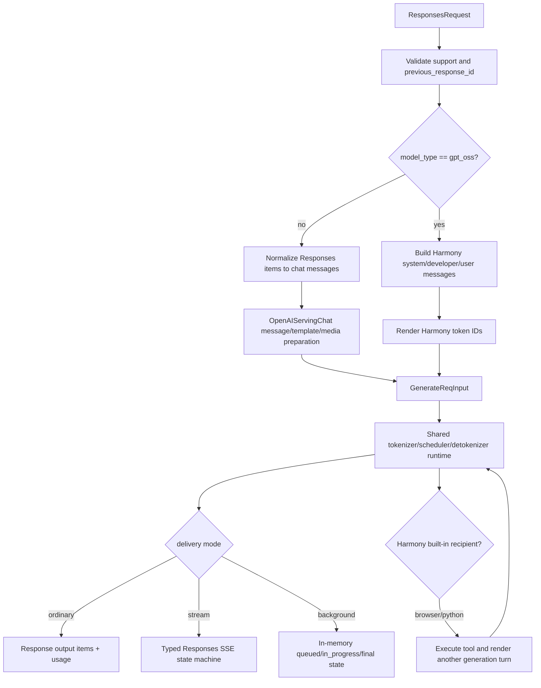

# OpenAI Responses API

The Responses API is SGLang's stateful, item-oriented generation adapter. It
still ends in the same `GenerateReqInput` and tokenizer/scheduler/detokenizer
path as chat completions, but it adds replayable response IDs, background
execution, reasoning and tool items, typed server-sent events, and a separate
GPT-OSS/Harmony conversation format.

This guide describes commit
[`f464e77d17a3908ad0ea32547b1e8b039bcbd354`](https://github.com/EltonChang1/sglang/tree/f464e77d17a3908ad0ea32547b1e8b039bcbd354).
The companion [file reference](reference/openai-responses.md) records exact
file status. It covers the Python SRT endpoint, not the independent Rust
`sgl-model-gateway` Responses implementation, which remains a Phase 8 topic.

## The useful mental model

A Responses request is not sent to a separate model runtime. The adapter first
chooses one of two prompt protocols:

The regular branch deliberately reuses chat preparation for templates, media,
tool grammar, stops, and reasoning configuration. The Harmony branch bypasses
chat templates: GPT-OSS messages are rendered to Harmony token IDs and parsed
back from channel/recipient tokens
([regular and Harmony request construction](https://github.com/EltonChang1/sglang/blob/f464e77d17a3908ad0ea32547b1e8b039bcbd354/python/sglang/srt/entrypoints/openai/serving_responses.py#L560-L617),
[`render_for_completion`](https://github.com/EltonChang1/sglang/blob/f464e77d17a3908ad0ea32547b1e8b039bcbd354/python/sglang/srt/entrypoints/harmony_utils.py#L231-L237)).

That split explains three otherwise surprising facts:

- function tools can be returned by either branch, but server-executed web
  search and Python are Harmony-only;
- regular streaming parses decoded text, while Harmony streaming parses raw
  token IDs and channel state; and
- a field accepted by `ResponsesRequest` can be echoed without affecting
  either prompt protocol.

## Public routes and object lifecycle

FastAPI exposes create, retrieve, and cancel routes. Create returns a Pydantic
response, an error response, or an async generator wrapped as
`text/event-stream`; retrieve and cancel only consult the adapter's local
store
([routes](https://github.com/EltonChang1/sglang/blob/f464e77d17a3908ad0ea32547b1e8b039bcbd354/python/sglang/srt/entrypoints/http_server.py#L1909-L1942)).

| Route | Meaning in this snapshot |
| --- | --- |
| `POST /v1/responses` | validate, prepare, generate, and return JSON, SSE, or a queued record |
| `GET /v1/responses/{id}` | read one locally stored response; it is not a durable lookup |
| `POST /v1/responses/{id}/cancel` | mark queued/in-progress background work cancelled and dispatch abort by the same ID |

`ResponsesRequest.request_id` is generated as `resp_<uuid>` and becomes both
the public response ID and the native runtime RID. Supplying a custom ID is an
SGLang extension; continuation and CRUD validate only the `resp_` prefix
([request identity](https://github.com/EltonChang1/sglang/blob/f464e77d17a3908ad0ea32547b1e8b039bcbd354/python/sglang/srt/entrypoints/openai/protocol.py#L1617-L1624),
[lookup and cancellation](https://github.com/EltonChang1/sglang/blob/f464e77d17a3908ad0ea32547b1e8b039bcbd354/python/sglang/srt/entrypoints/openai/serving_responses.py#L1400-L1461)).

### What the schema really supports

The request model accepts the current core OpenAI fields plus SGLang sampling,
session, priority, cache, and classification extensions. Validators normalize
replayed output items, default missing image detail to `auto`, translate
`reasoning.effort="none"` into both common chat-template thinking toggles, and
require a name for function tools
([request and validators](https://github.com/EltonChang1/sglang/blob/f464e77d17a3908ad0ea32547b1e8b039bcbd354/python/sglang/srt/entrypoints/openai/protocol.py#L1519-L1730)).

Support is narrower than validation:

| Field or family | Runtime effect |
| --- | --- |
| `input`, `instructions` | become regular chat messages or Harmony messages |
| `max_output_tokens`, temperature/top-p and SGLang sampling extras | become native sampling values |
| `text.format` | text is unconstrained; `json_object` or `json_schema` becomes a native JSON-schema grammar |
| `reasoning` | configures thinking and response reasoning/summary item shaping |
| function tools | enter chat/Harmony prompt format and can return `function_call` items |
| `web_search*`, `code_interpreter` | execute only through configured Harmony built-in tool sessions |
| `include=["message.output_text.logprobs"]` | enables non-stream, non-Harmony output token logprobs |
| `background`, `store`, `previous_response_id` | select local state and delivery behavior |
| `session_id`, `extra_key`, `cache_salt` | cross into `GenerateReqInput` |
| `metadata`, `user`, `truncation`, `parallel_tool_calls` | are echoed; `parallel_tool_calls` also enters the synthetic chat request |
| `service_tier`, `max_tool_calls` | validate but have no consumer in this adapter |
| most other `include` values and extended tool types | validate but do not enable an implementation |

`priority` is passed as a Python argument to `_generate_with_builtin_tools`,
but it is never copied into the constructed `GenerateReqInput`; the later
attempt to reduce priority after a built-in call also changes only a local
variable. It is therefore behaviorally inert on this path in the pinned
snapshot
([initial handoff](https://github.com/EltonChang1/sglang/blob/f464e77d17a3908ad0ea32547b1e8b039bcbd354/python/sglang/srt/entrypoints/openai/serving_responses.py#L427-L473),
[tool loop](https://github.com/EltonChang1/sglang/blob/f464e77d17a3908ad0ea32547b1e8b039bcbd354/python/sglang/srt/entrypoints/openai/serving_responses.py#L2531-L2604)).

## Regular input normalization

The non-Harmony branch converts the item-oriented API into the chat adapter's
message vocabulary. This is a semantic conversion, not a shallow rename
([normalizers](https://github.com/EltonChang1/sglang/blob/f464e77d17a3908ad0ea32547b1e8b039bcbd354/python/sglang/srt/entrypoints/openai/serving_responses.py#L963-L1133)):

- `input_text` and replayed `output_text` become chat `text` parts;
- `input_image` becomes `image_url`, with `detail="auto"` and optional dynamic
  patch limits nested where the media preprocessor expects them;
- a `developer` message becomes `system` because many chat templates do not
  recognize the former role;
- a `function_call` becomes an assistant message with one chat tool call;
  arguments are forced to a JSON-object string, degrading malformed or
  non-object arguments to `{}` so unconditional template decoding cannot fail;
- `function_call_output` becomes a chat `tool` message; list output is flattened
  to the text fields it contains; and
- a reasoning item becomes `assistant.reasoning_content`, preferring summary
  text so duplicated summary/content does not render twice.

Unknown item types fail before generation. Consecutive assistant fragments are
then merged so a message, reasoning fragment, and tool-call representation for
one logical turn do not make a chat template emit multiple assistant headers.
String/list content, tool-call lists, and reasoning text have separate merge
rules
([assistant merge](https://github.com/EltonChang1/sglang/blob/f464e77d17a3908ad0ea32547b1e8b039bcbd354/python/sglang/srt/entrypoints/openai/serving_responses.py#L1135-L1214)).

All system/developer text is collected into one leading system message. New
`instructions`, stored prior messages, and current input then enter the same
chat processing used by `/v1/chat/completions`. A text-only model rejects
media before native generation; a multimodal model forwards prompt text and
parallel image/video/audio arrays
([message construction](https://github.com/EltonChang1/sglang/blob/f464e77d17a3908ad0ea32547b1e8b039bcbd354/python/sglang/srt/entrypoints/openai/serving_responses.py#L1216-L1278),
[chat preparation reuse](https://github.com/EltonChang1/sglang/blob/f464e77d17a3908ad0ea32547b1e8b039bcbd354/python/sglang/srt/entrypoints/openai/serving_responses.py#L560-L603)).

### Continuation with `previous_response_id`

Continuation is an in-process replay, not a scheduler session or remote store.
Create first looks up a stored `ResponsesResponse`. The regular branch then:

1. reuses the exact input messages saved for that response;
2. appends text from prior `message` output items as assistant content;
3. ignores prior reasoning and non-message output items; and
4. appends and normalizes the new input.

This means a regular previous response containing only a returned function
call is not automatically reconstructed as an assistant tool-call turn. A
client can explicitly replay item-shaped input, but the `previous_response_id`
shortcut itself extracts only assistant text
([text extraction and replay](https://github.com/EltonChang1/sglang/blob/f464e77d17a3908ad0ea32547b1e8b039bcbd354/python/sglang/srt/entrypoints/openai/serving_responses.py#L1135-L1160),
[regular construction](https://github.com/EltonChang1/sglang/blob/f464e77d17a3908ad0ea32547b1e8b039bcbd354/python/sglang/srt/entrypoints/openai/serving_responses.py#L1216-L1278)).

The protocol validator drops a string output-item `id` only when the item also
has content. Without that rule, the OpenAI SDK union can misread a replayed
message as a content-free item reference. Bare item references remain accepted,
but this server does not resolve them
([input pre-validation](https://github.com/EltonChang1/sglang/blob/f464e77d17a3908ad0ea32547b1e8b039bcbd354/python/sglang/srt/entrypoints/openai/protocol.py#L1678-L1729)).

## Harmony input and history

For a GPT-OSS model, a new request receives a Harmony system message with
date, clamped reasoning effort, and configured browser/Python namespaces. A
developer message carries instructions and function-tool JSON schemas. Other
accepted tool types are omitted from the Harmony prompt
([message builders](https://github.com/EltonChang1/sglang/blob/f464e77d17a3908ad0ea32547b1e8b039bcbd354/python/sglang/srt/entrypoints/harmony_utils.py#L65-L136)).

Harmony has only low/medium/high reasoning effort. `minimal` maps to low and
`xhigh`/`max` to high; `none` is absent from the mapping and therefore leaves
the Harmony default. Structured output is rejected because a whole-output
JSON grammar would force `{` before Harmony's required analysis-channel
tokens. Harmony also accepts only `tool_choice="auto"`
([effort mapping](https://github.com/EltonChang1/sglang/blob/f464e77d17a3908ad0ea32547b1e8b039bcbd354/python/sglang/srt/entrypoints/harmony_utils.py#L44-L63),
[Harmony admission rules](https://github.com/EltonChang1/sglang/blob/f464e77d17a3908ad0ea32547b1e8b039bcbd354/python/sglang/srt/entrypoints/openai/serving_responses.py#L253-L283)).

On continuation, the implementation reuses the mutable message list from
`msg_store`. If the last message is final, it removes analysis messages from
the most recent completed turn before appending new input. The source
explicitly notes that new instructions and reasoning parameters are ignored on
this continuation branch
([Harmony history construction](https://github.com/EltonChang1/sglang/blob/f464e77d17a3908ad0ea32547b1e8b039bcbd354/python/sglang/srt/entrypoints/openai/serving_responses.py#L1280-L1354)).

Input messages, reasoning items, function calls, and function-call outputs are
mapped into Harmony role/channel/recipient records. Media parts are filtered
out rather than rendered, and a function-call output must find a matching
previous call ID or preprocessing fails
([Harmony input conversion](https://github.com/EltonChang1/sglang/blob/f464e77d17a3908ad0ea32547b1e8b039bcbd354/python/sglang/srt/entrypoints/harmony_utils.py#L142-L201)).

## Sampling and native handoff

The adapter calculates a prompt length, chooses an available-token default,
then calls `ResponsesRequest.to_sampling_params`. Requested output length is
clamped to that default and reduced by two tokens for engine-added BOS/EOS
headroom. Preferred sampling defaults fill only unset values. A Responses
`text.format` grammar and a chat-derived tool-call grammar are mutually
exclusive because both would control the same output stream
([sampling conversion](https://github.com/EltonChang1/sglang/blob/f464e77d17a3908ad0ea32547b1e8b039bcbd354/python/sglang/srt/entrypoints/openai/protocol.py#L1765-L1842)).

The surrounding default calculation uses at least 512 tokens even when the
remaining context is smaller. It therefore does not itself guarantee that a
near-limit prompt will fit; tokenizer/scheduler validation remains the final
authority. Values of `max_output_tokens` below the two-token headroom can also
produce a non-positive native budget. Neither boundary has a focused
Responses regression test
([budget calculation and request construction](https://github.com/EltonChang1/sglang/blob/f464e77d17a3908ad0ea32547b1e8b039bcbd354/python/sglang/srt/entrypoints/openai/serving_responses.py#L379-L470)).

The final `GenerateReqInput` carries prompt text or IDs, media, sampling,
stream mode, the response ID as RID, session/cache extensions, background
detachment, and `require_reasoning`. Output logprobs request every generated
token plus up to `top_logprobs` alternatives. Chat preparation can require
special-token preservation for reasoning/tool markers; the Responses adapter
must reapply that flag because it discards the temporary chat request after
preparation
([native adaptation](https://github.com/EltonChang1/sglang/blob/f464e77d17a3908ad0ea32547b1e8b039bcbd354/python/sglang/srt/entrypoints/openai/serving_responses.py#L412-L473)).

## Function calls and built-in tools

Tool support has three distinct meanings:

| Tool kind | Prompted | Executed by SGLang | Returned to caller |
| --- | --- | --- | --- |
| function | regular chat and Harmony | no | `function_call` item |
| web search | Harmony with browser backend | yes | web-search call item plus final model output |
| code interpreter | Harmony with Python backend | yes | code-interpreter call item plus final model output |
| accepted extended types | no execution path here | no | not synthesized |

For regular models, only function tools are converted into chat tools. A named
function choice is nested into the chat schema; object choices for built-in or
MCP tools degrade to `auto`, so the response echoes the behavior SGLang
actually used. `required` needs at least one function tool
([tool conversion](https://github.com/EltonChang1/sglang/blob/f464e77d17a3908ad0ea32547b1e8b039bcbd354/python/sglang/srt/entrypoints/openai/serving_responses.py#L963-L989),
[`effective_tool_choice`](https://github.com/EltonChang1/sglang/blob/f464e77d17a3908ad0ea32547b1e8b039bcbd354/python/sglang/srt/entrypoints/openai/protocol.py#L1744-L1763)).

Non-stream output parsing uses the configured model-specific function detector
when possible. Required calls fall back to a JSON object/array format when the
detector does not own a structural format. Visible content becomes a message
before parsed call items; the non-stream path does not preserve arbitrary
text/call/text interleaving
([output parsing](https://github.com/EltonChang1/sglang/blob/f464e77d17a3908ad0ea32547b1e8b039bcbd354/python/sglang/srt/entrypoints/openai/serving_responses.py#L801-L946)).

### Server-executed Harmony loop

`ConversationContext` isolates output accumulation and optional tool
execution. `SimpleContext` only retains the last native result. Harmony
contexts feed output token IDs to a streaming Harmony parser, detect a final
assistant recipient such as `browser.search` or `python`, execute the matching
session, append the tool message, rerender the full conversation, and start a
new native generation turn
([contexts](https://github.com/EltonChang1/sglang/blob/f464e77d17a3908ad0ea32547b1e8b039bcbd354/python/sglang/srt/entrypoints/context.py#L20-L231),
[generation loop](https://github.com/EltonChang1/sglang/blob/f464e77d17a3908ad0ea32547b1e8b039bcbd354/python/sglang/srt/entrypoints/openai/serving_responses.py#L2531-L2604)).

There is no `max_tool_calls` enforcement in that loop. It terminates only when
the model stops asking for a recognized built-in recipient or an error escapes.
Each continuation recomputes remaining context and sets at least one output
token, but the loop has no explicit iteration or wall-time limit.

At server startup, `--tool-server demo` creates optional Exa browser and
GPT-OSS Python tools; a comma-separated `--tool-server` value discovers
external MCP SSE namespaces; otherwise `EXA_API_KEY` alone enables native Exa
web search. MCP built-ins are rejected for background and streaming requests,
so their async session lifetime remains inside the create request
([server assembly](https://github.com/EltonChang1/sglang/blob/f464e77d17a3908ad0ea32547b1e8b039bcbd354/python/sglang/srt/entrypoints/http_server.py#L342-L379),
[mode restriction](https://github.com/EltonChang1/sglang/blob/f464e77d17a3908ad0ea32547b1e8b039bcbd354/python/sglang/srt/entrypoints/openai/serving_responses.py#L321-L337)).

The MCP adapter trims JSON Schema into Harmony's smaller dialect and may omit
tools whose annotations exclude them from the prompt. It maps a namespace to
one SSE URL and opens a fresh initialized session per request. Only the
`browser` and `python` namespace names are consumed by `HarmonyContext` in this
snapshot
([MCP adapter](https://github.com/EltonChang1/sglang/blob/f464e77d17a3908ad0ea32547b1e8b039bcbd354/python/sglang/srt/entrypoints/openai/tool_server.py#L20-L142)).

### Native Exa browser

`ExaClient` builds authenticated `/search` and `/contents` JSON requests,
reuses one locked `aiohttp` session, bounds result count and search type from
environment configuration, and raises `ExaClientError` on HTTP or JSON decode
failure
([client and configuration](https://github.com/EltonChang1/sglang/blob/f464e77d17a3908ad0ea32547b1e8b039bcbd354/python/sglang/srt/entrypoints/search/exa_client.py#L1-L138)).

`HarmonyBrowserTool` keeps cursor-to-page and page-text maps on the request's
conversation context. Search resets that state; open resolves a cursor or URL;
find searches a loaded page, direct URL, or available snippets. Results and
page text are deliberately truncated before re-entering the model prompt.
Tool failures are converted into a tool message so the model can recover,
rather than failing the whole response
([browser tool](https://github.com/EltonChang1/sglang/blob/f464e77d17a3908ad0ea32547b1e8b039bcbd354/python/sglang/srt/entrypoints/tool.py#L29-L257)).

`HarmonyPythonTool` is enabled only when the optional `gpt_oss` package is
available. Demo mode can execute model-authored Python, including a host-backed
mode selected by environment configuration; this is an operational trust
boundary, not merely response formatting
([Python tool](https://github.com/EltonChang1/sglang/blob/f464e77d17a3908ad0ea32547b1e8b039bcbd354/python/sglang/srt/entrypoints/tool.py#L259-L286),
[user documentation](https://github.com/EltonChang1/sglang/blob/f464e77d17a3908ad0ea32547b1e8b039bcbd354/docs/cookbook/autoregressive/OpenAI/GPT-OSS.mdx#L437-L504)).

## Non-stream response shaping

The result generator is fully consumed first. Regular output then passes
through a reasoning parser and function-call parser; Harmony output is built
from parsed channel messages plus any incomplete parser state
([full response generator](https://github.com/EltonChang1/sglang/blob/f464e77d17a3908ad0ea32547b1e8b039bcbd354/python/sglang/srt/entrypoints/openai/serving_responses.py#L619-L745),
[Harmony output conversion](https://github.com/EltonChang1/sglang/blob/f464e77d17a3908ad0ea32547b1e8b039bcbd354/python/sglang/srt/entrypoints/harmony_utils.py#L247-L397)).

Reasoning becomes a `reasoning` item with full trace content. When
`reasoning.summary` is requested, the same parsed text is duplicated into a
summary part; SGLang does not generate a separate concise or detailed summary.
Visible text becomes an assistant message, and calls become completed function
call items. Annotations remain empty.

Only finish reason `length` maps to response status `incomplete`; every other
reason reaching the shaper maps to `completed`. Incomplete responses receive
`{"reason":"max_output_tokens"}` regardless of the exact upstream length
source
([status mapping](https://github.com/EltonChang1/sglang/blob/f464e77d17a3908ad0ea32547b1e8b039bcbd354/python/sglang/srt/entrypoints/openai/serving_responses.py#L747-L759),
[response construction](https://github.com/EltonChang1/sglang/blob/f464e77d17a3908ad0ea32547b1e8b039bcbd354/python/sglang/srt/entrypoints/openai/protocol.py#L1914-L2006)).

Output logprobs are available only for ordinary non-Harmony requests. They are
converted for every generated token, including tokens later removed or split
into reasoning/tool structure, so their span need not match only the final
visible text
([conversion](https://github.com/EltonChang1/sglang/blob/f464e77d17a3908ad0ea32547b1e8b039bcbd354/python/sglang/srt/entrypoints/openai/serving_responses.py#L89-L119),
[attachment](https://github.com/EltonChang1/sglang/blob/f464e77d17a3908ad0ea32547b1e8b039bcbd354/python/sglang/srt/entrypoints/openai/serving_responses.py#L659-L680)).

## Storage, background work, retrieval, and cancellation

Two unbounded dictionaries own state:

- `msg_store` keeps normalized input messages for continuation; and
- `response_store` keeps queued, in-progress, or terminal response objects for
  retrieval and cancellation.

They have no TTL, persistence, cross-process coordination, or capacity limit.
Server restart loses them, and multiple API workers do not gain a shared view.
The source explicitly recommends a production storage backend
([store initialization](https://github.com/EltonChang1/sglang/blob/f464e77d17a3908ad0ea32547b1e8b039bcbd354/python/sglang/srt/entrypoints/openai/serving_responses.py#L178-L192)).

`store=True` records input messages immediately. Ordinary JSON and completed
stream responses enter `response_store` only at completion. A non-stream
background request instead inserts a `queued` object, starts an asyncio task,
changes it to `in_progress`, and replaces it with the final response. An
adapter error changes status to `failed` but does not populate a structured
error on the stored object
([delivery selection](https://github.com/EltonChang1/sglang/blob/f464e77d17a3908ad0ea32547b1e8b039bcbd354/python/sglang/srt/entrypoints/openai/serving_responses.py#L475-L558),
[background runner](https://github.com/EltonChang1/sglang/blob/f464e77d17a3908ad0ea32547b1e8b039bcbd354/python/sglang/srt/entrypoints/openai/serving_responses.py#L1356-L1398)).

Cancellation is intentionally idempotent for terminal responses. For queued or
in-progress work it marks the stored object cancelled under a lock, dispatches
native abort by the response ID, cancels the local background task, and refuses
to let a racing completion overwrite `cancelled`. A non-background stream is
not placed in `response_store` while active, so the CRUD cancel route cannot
cancel it by ID; connection/disconnect handling remains the relevant path
([cancellation](https://github.com/EltonChang1/sglang/blob/f464e77d17a3908ad0ea32547b1e8b039bcbd354/python/sglang/srt/entrypoints/openai/serving_responses.py#L1414-L1443),
[store race guard](https://github.com/EltonChang1/sglang/blob/f464e77d17a3908ad0ea32547b1e8b039bcbd354/python/sglang/srt/entrypoints/openai/serving_responses.py#L729-L740)).

## Typed SSE streaming

Responses streaming does not use chat chunks or a final `[DONE]`. Both stream
generators emit typed events with monotonically increasing sequence numbers,
starting with `response.created` and `response.in_progress`, and ending with a
response snapshot event.

### Regular models

The regular state machine accepts cumulative or incremental decoded text. It
passes each new suffix through the reasoning parser, then a function-call
parser, and owns separate open states for reasoning, visible messages, and
each indexed tool call
([stream setup](https://github.com/EltonChang1/sglang/blob/f464e77d17a3908ad0ea32547b1e8b039bcbd354/python/sglang/srt/entrypoints/openai/serving_responses.py#L1894-L2028),
[chunk loop](https://github.com/EltonChang1/sglang/blob/f464e77d17a3908ad0ea32547b1e8b039bcbd354/python/sglang/srt/entrypoints/openai/serving_responses.py#L2217-L2459)).

Each item follows an added/delta/done lifecycle. Before a new semantic item is
opened, the previous incompatible item is closed, appended to `emitted_items`,
and assigned a stable output index. The parser returns text and calls as an
unordered pair, so the adapter classifies calls that continue an already-open
item before emitting intervening prose and newly opened calls. This preserves
text/tool/text and multi-call wire order even when one engine delta crosses
several parser boundaries. Whitespace while a qwen3-coder call is open is
treated as an inter-call separator, not a user-visible message
([close/open state helpers](https://github.com/EltonChang1/sglang/blob/f464e77d17a3908ad0ea32547b1e8b039bcbd354/python/sglang/srt/entrypoints/openai/serving_responses.py#L2029-L2215),
[ordering logic](https://github.com/EltonChang1/sglang/blob/f464e77d17a3908ad0ea32547b1e8b039bcbd354/python/sglang/srt/entrypoints/openai/serving_responses.py#L2320-L2459)).

The reasoning and function parsers are flushed once a non-abort finish reason
arrives. Without this, a trailing prefix that might have become a special
marker would be lost. Exceptions inside the main stream loop become one typed
`response.failed` event and stop the generator; the failed snapshot is not
stored. Successful completion closes open items, serializes usage, optionally
stores the response, and emits `response.completed` even when the response
status field is `incomplete`
([failure and completion](https://github.com/EltonChang1/sglang/blob/f464e77d17a3908ad0ea32547b1e8b039bcbd354/python/sglang/srt/entrypoints/openai/serving_responses.py#L2461-L2529)).

Streaming logprobs are rejected before the generator is created. Extended tool
definitions are removed from the initial and final streamed response snapshots
because the installed OpenAI SDK's typed event union cannot validate them;
non-stream responses echo the tools. These are explicit cross-mode differences,
not scheduler behavior
([admission](https://github.com/EltonChang1/sglang/blob/f464e77d17a3908ad0ea32547b1e8b039bcbd354/python/sglang/srt/entrypoints/openai/serving_responses.py#L253-L266),
[stream sanitization](https://github.com/EltonChang1/sglang/blob/f464e77d17a3908ad0ea32547b1e8b039bcbd354/python/sglang/srt/entrypoints/openai/serving_responses.py#L1917-L1943)).

### GPT-OSS/Harmony models

Harmony streaming feeds output IDs into `StreamingHarmonyContext`, which
deduplicates cumulative output by processed-token count and incorporates tool
messages into the same parser before rerendering. The stream generator watches
parser channel, recipient, and assistant-action stop tokens; it emits final
text, analysis, web-search, and code-interpreter event families
([streaming context](https://github.com/EltonChang1/sglang/blob/f464e77d17a3908ad0ea32547b1e8b039bcbd354/python/sglang/srt/entrypoints/context.py#L184-L231),
[Harmony stream](https://github.com/EltonChang1/sglang/blob/f464e77d17a3908ad0ea32547b1e8b039bcbd354/python/sglang/srt/entrypoints/openai/serving_responses.py#L1463-L1892)).

This path is shallower than the regular state machine. It has an explicit TODO
for disconnect handling, uses one `current_item_id` across successive items,
does not wrap the main loop in a typed failure-event handler, and does not
update `StreamingHarmonyContext` token usage counters. Its final response is
built by the non-stream shaper over parser state, so streamed usage remains
zero in this implementation. Focused Responses streaming tests exercise the
regular path, not these Harmony invariants.

## Usage and error contracts

`ResponsesResponse` internally carries the shared chat-style `UsageInfo`, but
a field serializer changes the wire shape to `input_tokens`,
`output_tokens`, nested cached/reasoning details, and `total_tokens`. Cache
write tokens are always zero. Regular paths read tokenizer metadata; Harmony
contexts maintain their own counters, with the streaming limitation above
([usage serializer](https://github.com/EltonChang1/sglang/blob/f464e77d17a3908ad0ea32547b1e8b039bcbd354/python/sglang/srt/entrypoints/openai/protocol.py#L1846-L1912)).

The adapter and FastAPI exception handlers use the nested OpenAI error envelope
`{"error":{"message", "type", "param", "code"}}`. Request validation is
mapped from 422 to 400. Preprocessing catches media validation, common value/
type/runtime failures, and Jinja errors; other non-stream generator failures
become a 400 adapter response, while regular streaming errors are in-band typed
events
([HTTP exception adaptation](https://github.com/EltonChang1/sglang/blob/f464e77d17a3908ad0ea32547b1e8b039bcbd354/python/sglang/srt/entrypoints/http_server.py#L529-L630),
[create error boundaries](https://github.com/EltonChang1/sglang/blob/f464e77d17a3908ad0ea32547b1e8b039bcbd354/python/sglang/srt/entrypoints/openai/serving_responses.py#L234-L341)).

The schema makes `model` optional, but `create_responses` forwards that value
as the required string `ResponsesResponse.model` instead of substituting the
served model name. Focused tests always supply a model, so an omitted model is
an untested validation/runtime mismatch in this snapshot
([request field](https://github.com/EltonChang1/sglang/blob/f464e77d17a3908ad0ea32547b1e8b039bcbd354/python/sglang/srt/entrypoints/openai/protocol.py#L1597-L1603),
[response field and construction](https://github.com/EltonChang1/sglang/blob/f464e77d17a3908ad0ea32547b1e8b039bcbd354/python/sglang/srt/entrypoints/openai/protocol.py#L1852-L1865)).

## Operational boundaries and failure modes

- **State is local and unbounded.** Treat `store` and
  `previous_response_id` as single-process convenience features, not a durable
  conversation service.
- **Tool execution expands the trust boundary.** Native Exa sends queries and
  URLs to an external service. Demo Python executes model-authored code through
  an optional backend. External MCP URLs are startup-time network dependencies.
- **Accepted is not implemented.** `file_search`, image generation, computer
  use, shell, generic MCP/custom/namespace, and several include fields have no
  Responses execution branch here.
- **Function output continuation differs by prompt protocol.** Harmony can
  resolve a `function_call_output` against previous output calls. The regular
  `previous_response_id` shortcut replays only text output items.
- **Tool loops are not bounded by `max_tool_calls`.** Apply external time and
  resource limits when enabling server-executed tools.
- **Cross-mode output is not identical.** Streaming omits tool definitions,
  logprobs are non-stream regular-only, reasoning summaries duplicate the
  trace, and Harmony streaming has weaker item/usage/error guarantees.
- **Output status is a narrow mapping.** Only length is incomplete; abort and
  other finish reasons that reach the ordinary shaper become completed.
- **Initialization can disable only this endpoint.** Failure to import or
  initialize the Responses handler is logged and server startup continues, so
  health does not prove `/v1/responses` exists
  ([optional initialization](https://github.com/EltonChang1/sglang/blob/f464e77d17a3908ad0ea32547b1e8b039bcbd354/python/sglang/srt/entrypoints/http_server.py#L357-L379)).

## What the tests prove

The focused CPU suites are unusually strong on regular adapter mechanics:

- protocol tests cover tool validation, sampling/grammar conflicts, structured
  output, thinking toggles, response echo/status/usage serialization, replayed
  string IDs, and effective tool choice
  ([protocol suite](https://github.com/EltonChang1/sglang/blob/f464e77d17a3908ad0ea32547b1e8b039bcbd354/test/registered/unit/entrypoints/openai/test_responses_protocol.py#L1-L410));
- serving tests cover regular history/message/media conversion, reasoning and
  special-token forwarding, required/native tool parsing, logprobs, status,
  cancellation idempotency, and stream-logprob rejection
  ([serving suite](https://github.com/EltonChang1/sglang/blob/f464e77d17a3908ad0ea32547b1e8b039bcbd354/test/registered/unit/entrypoints/openai/test_serving_responses.py#L1-L993));
- stream tests cover typed event order and sequence numbers, required calls,
  parser flush, final item ordering, and multi-call delta boundaries on the
  non-Harmony path
  ([stream suite](https://github.com/EltonChang1/sglang/blob/f464e77d17a3908ad0ea32547b1e8b039bcbd354/test/registered/unit/entrypoints/openai/test_serving_responses_stream.py#L1-L313));
- Exa tests mock all network work while verifying headers, payloads,
  environment configuration, native server selection, request-scoped cursors,
  search/open/find behavior, and missing-backend rejection
  ([Exa suite](https://github.com/EltonChang1/sglang/blob/f464e77d17a3908ad0ea32547b1e8b039bcbd354/test/registered/unit/entrypoints/openai/test_exa_search.py#L1-L303)); and
- the broad live server class checks basic JSON/SSE objects, length status,
  nested errors, penalties, and usage against a small model
  ([integration slice](https://github.com/EltonChang1/sglang/blob/f464e77d17a3908ad0ea32547b1e8b039bcbd354/test/registered/openai_server/basic/test_openai_server.py#L600-L950)).

Important gaps remain:

- no focused test covers queued-to-running-to-completed background retrieval,
  failure storage, or cancellation racing native completion;
- no test covers regular continuation after a function-call-only response;
- no test covers missing `model`, `max_output_tokens <= 2`, near-limit default
  budgeting, `priority`, or `max_tool_calls`;
- no focused test covers Harmony stream item IDs, usage, errors, disconnects,
  reasoning summaries, or multiple built-in turns;
- no test covers MCP schema trimming/session failures, duplicate namespace
  names, or the Python tool adapter; and
- the live stream test makes usage validation non-binding with
  `assert final_usage_ok or True`.

GPU/model end-to-end behavior, external Exa/MCP services, and model-authored
Python execution require resources and credentials outside the CPU suites.

## Study checks

1. Explain why the regular path can reuse chat preparation without returning a
   chat-completion response.
2. Trace a replayed `output_text`, `function_call`, and
   `function_call_output` into regular chat messages and Harmony messages.
3. Identify which request fields execute, which only echo, and which have no
   consumer.
4. Explain why function tools return control to the client while Harmony
   browser/Python tools can start another model turn inside the server.
5. Trace one cumulative regular stream through reasoning, text, tool-call, and
   final response item states.
6. Explain why `store=True` is insufficient for durable or multi-worker
   response retrieval.
7. Compare ordinary, streaming, and background cancellation ownership.
8. List the weaker guarantees on Harmony streaming before relying on it in an
   operational design.

The next Phase 3 unit should cover Anthropic Messages, then Ollama and gRPC.
Parser-family internals, generic sessions, and the independent gateway
Responses stack retain their later owning passes.
